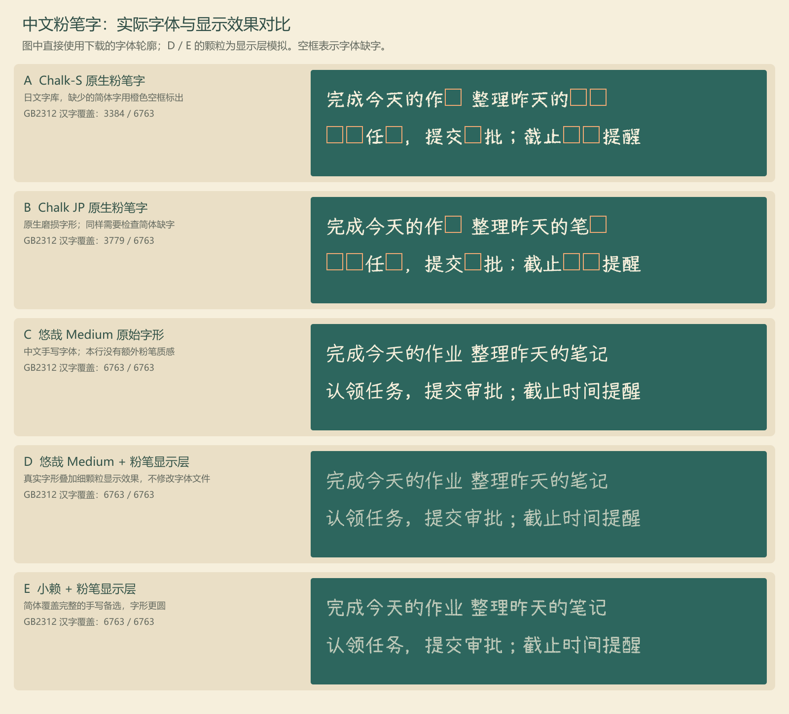

# 中文任务粉笔字体调研与实际字样

日期：2026-09-09。目标是在没有投影和画板时，用粉笔字显示公共任务板前面的几条中文标题。英文日期已经确定为 CHAWP，本报告不重新选择日期字体；它检查中文任务需要的简体字形、粉笔效果、授权和网页加载方式，尚未把字体接入网站。

## 建议与实样

当前建议优先比较悠哉 Medium 加适量粉笔颗粒显示的方案，小赖提供更圆的另一种手写字形。两款字体都提供明确的 OFL 1.1 授权，实际检查覆盖全部 6763 个 GB2312 汉字；原生粉笔字形候选 Chalk-S 和 Chalk JP 在常用简体字上有明显缺失，不能直接作为动态中文任务的唯一字体。

这个建议不把普通手写字形等同于原生粉笔字体。悠哉与小赖本身没有粉笔磨损，必须通过独立显示层模拟，下面分别标明原始字形与颗粒效果，便于判断是否符合预期。整页教室效果图由图像模型绘制，精确字体效果以下面的真实轮廓渲染为准。

样张使用字体文件的真实字形轮廓，没有调用系统后备字体补齐缺字。橙色空框表示该字体确实没有对应字符；D、E 行增加了确定性的颗粒显示层，字体文件没有被修改。测试句子为“完成今天的作业 整理昨天的笔记”和“认领任务，提交审批；截止时间提醒”，覆盖任务内容与工作流程常见用字。

## 来源与覆盖结果

本轮搜索了中文粉笔字体的公开资料，并追溯到字体作者页面、发布包及授权文本。浏览器查询超时后改为读取公开页面与官方仓库资料；未登录字体商店或提交用户的真实任务内容。检测使用下载文件的 Unicode 字符映射，GB2312 汉字集合通过编码表逐字生成。

| 字体 | 当前核对的来源及授权 | GB2312 汉字覆盖 | 对动态中文任务的适用性 |
| --- | --- | --- | --- |
| Chalk-S | [作者说明](https://font.cutegirl.jp/chalk-s.html)，原包附 OFL 1.1；基于 Stick 改制 | 3384 / 6763 | 有原生粉笔颗粒，但缺“业、务、审、认、领”等字，不适合直接整段使用 |
| Chalk JP | [作者说明](https://font.cutegirl.jp/chalk-font-free.html)，原包附 OFL 1.1；基于 Klee One 改制 | 3779 / 6763 | 原生粉笔边缘较细，仍缺大量任务常用简体字 |
| 悠哉 Medium v0.868 | [作者仓库](https://github.com/lxgw/yozai-font)、[版本发布](https://github.com/lxgw/yozai-font/releases/tag/v0.868)、[授权](https://github.com/lxgw/yozai-font/blob/master/OFL.txt) | 6763 / 6763 | 本次样句无缺字；手写笔势比较自然，适合尝试独立粉笔显示层 |
| 小赖 v3.126 | [作者仓库](https://github.com/lxgw/kose-font)、[版本发布](https://github.com/lxgw/kose-font/releases/tag/v3.126)、[授权](https://github.com/lxgw/kose-font/blob/master/OFL.txt) | 6763 / 6763 | 本次样句无缺字；字形相对圆，作为另一种可直接嵌入的中文手写候选 |
| CHAWP | [作者仓库](https://github.com/awp/chawp)、[授权](https://github.com/awp/chawp/blob/master/LICENSE) | 不承担中文 | 继续用于 WED, SEP 09 形式的英文日期，所需字符已经验证 |

GB2312 全覆盖表示对这一具体字符集合的检查结果，不表示覆盖所有汉字、姓名、特殊符号或表情。悠哉作者说明已扩充基本汉字区，但也提示部分字形可能保留日文字形特征；小赖同样说明个别字形可能不完全符合大陆字形规范。实现时仍需保留清晰的中文后备字体，不能让少见字符变成空框。

前轮已经发现陈代明粉笔体演示版、邯郸粉笔中黑体、上首粉笔体及韩绍杰毛楷粉笔简体等商业或授权未核对完整的线索，详见[前轮资料与来源](classroom-desks-and-chalk-research-2026-09-09.md#比较结果与来源范围)。本次不重复下载演示版，也不把目录站的免费试用等同于网页字体嵌入许可；如后续选择其中的原生中文粉笔字形，需要取得对应的网页使用条件。

## 网页使用方式

任务标题保持为真实文字，由网页使用本地托管字体显示，颗粒通过静态纹理遮罩或受控的显示滤镜添加。网页不需要把每个新任务发送给图像模型，也不需要在任务变化时向外部字体服务提交标题。字体纹理应保持静止，不能持续闪动；细字号和窄屏适当降低磨损程度，避免标题难以辨认。

整段中文优先采用同一款字形覆盖充分的字体。若把 Chalk-S 用于它支持的字、再以另一款字体补缺字，同一个标题会出现明显的笔形和粗细变化，因此不建议自动混用。用户的任务文本也不应为适配字库而转换成繁体。

正式发布时将所选字体本地托管，保留原版权和 OFL 文本。可以制作 WOFF2 分段并用 unicode-range 按需加载，保证后续任意新增任务能取得对应字符；这项分段方案尚未实现。颗粒应作用于实际文本显示层，辅助访问、搜索和复制仍使用原始标题。

## 文件体积与验证范围

| 字体 | 下载字体文件 | 本次固定检测语料的 WOFF2 子集 |
| --- | ---: | ---: |
| Chalk-S | 5,145,856 字节 | 16,784 字节 |
| Chalk JP | 11,949,376 字节 | 24,168 字节 |
| 悠哉 Medium | 15,238,394 字节 | 11,644 字节 |
| 小赖 | 22,220,806 字节 | 9,356 字节 |

右列只包含本次几句测试文字及少量界面字，不能用它代表任意中文任务所需的字体体积。正式部署需要覆盖持续变化的任务标题，不能只上传这个固定样本子集。样本检测时 FontTools 对部分排版表有跳过提示，因此这些子集只用于体积与字形验证，不作为经过完整网页排版验收的发布文件。

[覆盖检测数据](assets/chinese-chalk-coverage-2026-09-09.json)保留了字符数、缺字名单、文件体积及 SHA-256。实际样张已经查看；本轮没有执行手机上的字体加载、浏览器滤镜性能或网络缓存测试，这些属于正式接入时的验证内容。

可复现的下载包、授权、检测脚本和字体样张源文件保存在 codex-generated/classroom-v3 中，正式文档和最终图片在 docs 内。当前状态为已调研未实现，最终中文粉笔视觉仍可依据实样继续调整。
