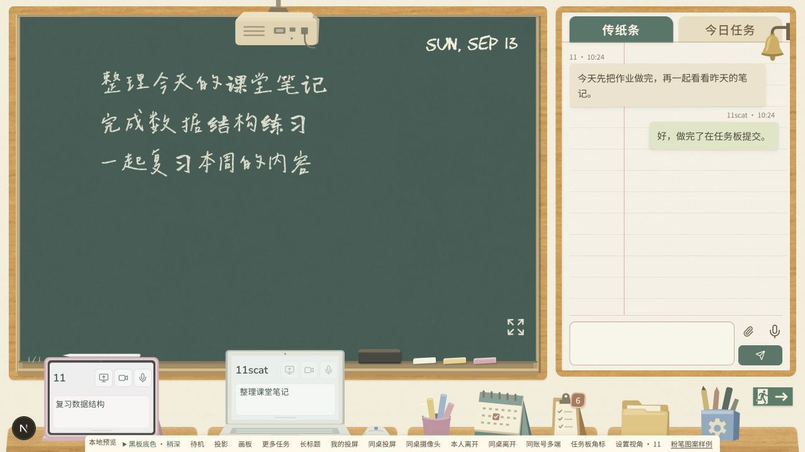
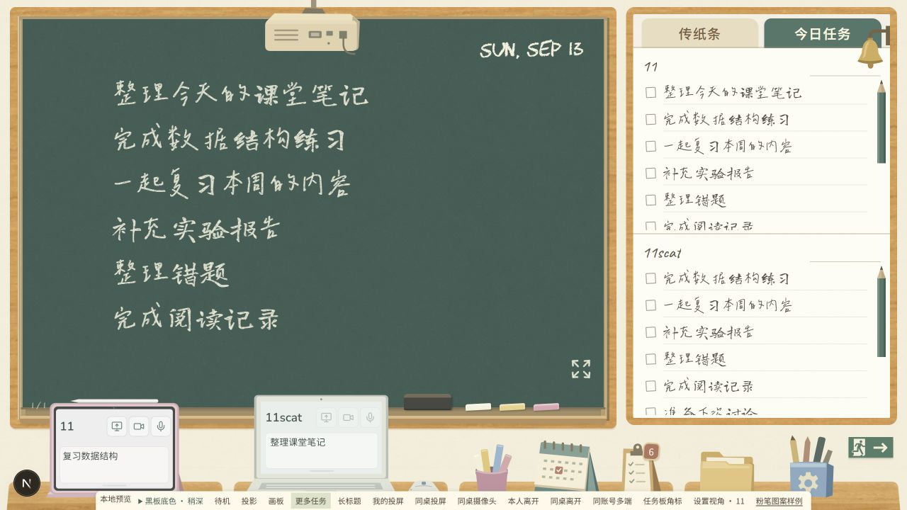
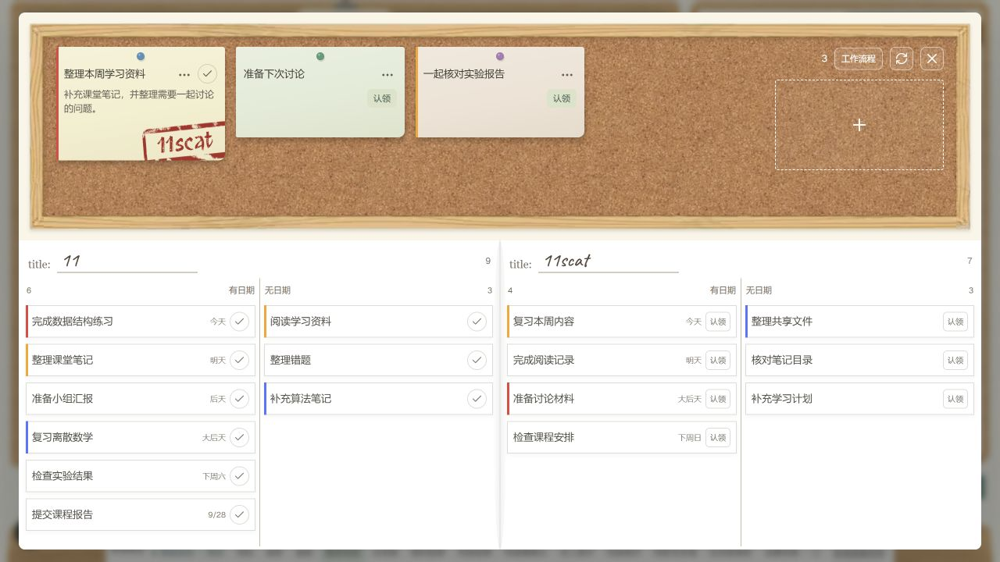

# 教室现行美术参照

更新时间：2026-09-13。教室已经完成多轮外观更新，后续制作以用户最新确认并正式接入的页面、素材和样式为准；2026-09-09 的整页效果图只保留为设计来源，不再要求新素材与它逐项一致。

本次依据代码版本 [704a863](https://github.com/yuumiqwq/duo-space/commit/704a8631b616d55d4a89d20740570f701c7f7566) 核对，并使用该版本的正式组件截取样例页面。后续批准的新外观应直接更新本文及对应截图，文件名称不随每次更新另加日期；未批准的候选稿不能因出现在仓库或预览中就成为新的参照。

## 当前页面样例

以下三图在 2026-09-13 从本地 `/classroom-preview` 截取，使用已有样例消息与任务，不包含线上私人记录。截图尺寸为 1280×720，底部的“本地预览”工具条及左下角开发按钮只属于调试页面，不属于正式界面；截图用于辨认整体关系，物件完整轮廓及各状态以本页链接的正式素材为准。

### 教室与传纸条

前两桌采用平板和白色笔记本，第三桌放置粉笔筒、双人日历物件与任务板入口，右侧桌面提供文件夹和设置笔筒。平板顶部白色磁吸笔与笔记本旁独立鼠标均属于后续正式更新，不应退回早期人物或个人台历方案。

### 今日任务纸面

今日任务采用浅色横线纸面、手写字和铅笔滚动条，传纸条沿用其已确认的纸张与页边线关系。截图启用了“更多任务”样例以显示滚动条，不限定真实任务的数量、内容或显示顺序。

### 任务板与成员任务区

公共任务位于木框软木公告板内，使用图钉固定；下方是白色笔记本式成员任务区，保留中间分界和紧凑行。公共便签与成员任务卡的认领印章分别使用各自已确认的显示方式，不能根据早期截图把它们统一改回同一种大小。

## 正式素材与样式依据

| 部分 | 当前外观及维护入口 |
| --- | --- |
| 黑板、木框与桌面 | 黑板采用已选定的稍深灰绿 `#3c645a`，叠加现有细颗粒与覆盖层；木框和桌面保留已确认木纹。查看[场景样式](../app/classroom.css)、[场景组件](../app/ClassroomScene.tsx)和[黑板纹理](../public/classroom/board-grain.png)。 |
| 平板与白色笔记本 | 使用同一设备的亮屏、暗屏成对素材，保持保护套、支撑与摆放比例。查看[平板亮屏](../public/classroom/tablet-on.svg)、[平板暗屏](../public/classroom/tablet-off.svg)、[笔记本亮屏](../public/classroom/laptop-on.svg)、[笔记本暗屏](../public/classroom/laptop-off.svg)及[设备组件](../app/ClassroomDevices.tsx)。 |
| 鼠标与磁吸笔 | 鼠标采用简化米白壳面、灰绿侧面和蓝灰滚轮，接触桌面的后缘为水平线；磁吸笔已包含在两份平板 SVG 中。查看[鼠标素材](../public/classroom/mouse-white.svg)和[设备素材说明](../public/classroom/devices-README.md)。 |
| 桌面物件 | 粉笔筒采用已选定的莓果粉，设置笔筒采用晴空蓝；日历保留灰绿支架与米白纸面。查看[粉笔筒](../public/classroom/chalk-cup-flat.svg)、[设置笔筒](../public/classroom/settings-flat.svg)、[日历物件](../public/classroom/calendar-entry.svg)、[任务夹板](../public/classroom/taskboard-flat.svg)和[文件夹](../public/classroom/folder-flat.svg)。 |
| 公告板与图钉 | 保留[软木背景](../public/classroom/taskboard-cork-reference.webp)和[木框素材](../public/classroom/taskboard-frame-reference.webp)。图钉使用五种已确认颜色，由任务编号决定颜色；形状及成员任务区查看[协作样式](../app/room-collaboration.css)和[图钉配色规则](../app/collaboration-view.ts)。 |
| 纸面与滚动条 | 保留[纸张纹理](../public/classroom/paper-fiber.jpg)及现有横线、页边线；铅笔滚动条沿用正式 CSS 和[笔尖](../public/classroom/pencil-tip.svg)，包括已确认的右移位置。不支持定制形状的浏览器保留对应颜色的原生滑块。 |
| 字体与印章 | 黑板中文沿用 Classroom Yan / Long Cang，英文日期使用 CHAWP，设备文字采用网站提供的资源圆体及 Nunito。印章沿用[现有组件](../app/InboxClaimStamp.tsx)及其字形、墨迹和倾角；字体完整署名与许可见[素材署名](../public/classroom/ATTRIBUTION.md)。 |

素材存在不表示当前页面使用它。原生成图集、单独相机及麦克风等保留文件应按组件引用判断用途；双人日历目前只有物件入口，功能状态以[当前功能说明](current-functionality.md)为准。

## 后续修改的对照方式

先核对用户最新明确的调整要求，再查看相关正式组件在页面中的效果，并同时对照待修改物件及其相邻素材。历史效果图、官方产品照片和旧生成提示词可用于追溯来源或核对外形，不能覆盖已经确认的成品配色、比例及布局。

整体继续沿用低饱和配色、简化轮廓与哑光质感，物件通常由少量平面色块表达。现有木纹、软木颗粒和已批准的局部灯光继续保留，不因为整理参照而统一抹去；新增素材不能引入与相邻物件不一致的写实产品渲染、密集高光或复杂体积明暗。

放置只允许等比缩放、平移或旋转，同桌物件使用一致的观看角度，接触桌面的边缘应对应实际场景位置。修改亮屏或暗屏设备时一起检查另一状态，局部调整也须核对相邻物件的大小与接触关系，避免改变其他已确认部分。

所有新增和重绘素材仍须先展示具体预览，取得用户对该版本的明确同意后才能接入正式路径并发布。待确认素材放在 `codex-generated`，常规提交与推送授权不替代素材审批；本次截图仅记录现有成品，没有重新绘制或改变页面素材。

## 历史来源与许可

[2026-09-09 早期效果图](assets/classroom-approved-material-reference-2026-09-09.png)与[原始生成提示词](classroom-asset-prompts-2026-09-09.md)继续保留，供查阅制作由来。原《教室固定美术参照》可在[旧文档固定版本](https://github.com/yuumiqwq/duo-space/blob/704a8631b616d55d4a89d20740570f701c7f7566/docs/classroom-flat-style-2026-09-09.md)查阅，其中要求后续一律对照早期原图的约束已由本文替代。

前期设计与发布许可见[教室设计历史](archive/2026-09/classroom-design.md)，后续配色及设备调整见[上线后素材记录](archive/2026-09/post-release-fixes.md)，字体与纹理许可继续随[正式素材](../public/classroom/ATTRIBUTION.md)保存。制作和发布仍遵循 [AGENTS.md](../AGENTS.md)，历史批准只适用于当时明确确认的范围。
