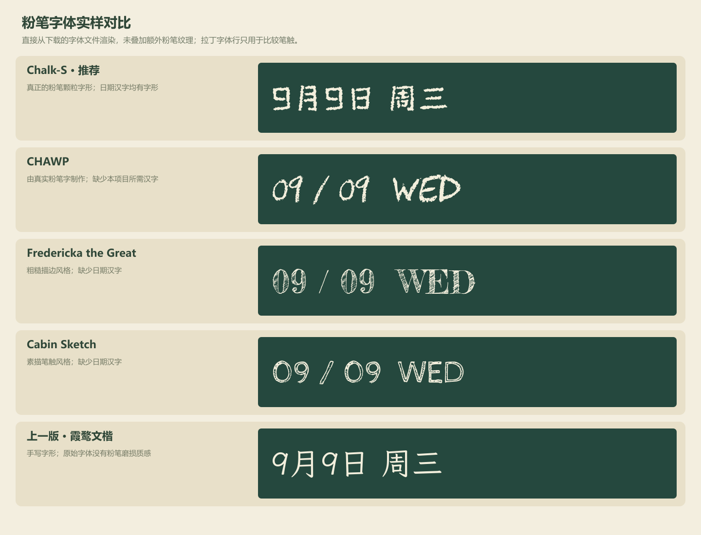

# 教室课桌布局与粉笔字体复调研

后续状态：用户已否定本文偏写实的整页插画，选定 CHAWP 并同意英文日期，当前要求与四种状态效果图见[书堆卡片与四种界面状态](classroom-flat-style-2026-09-09.md)。本文保留前轮字体调研证据，不再将 Chalk-S 作为实施推荐；新增的中文任务粉笔字需求见[最新字形覆盖与实样调研](chinese-chalk-font-research-2026-09-09.md)，不沿用本文仅针对日期汉字的覆盖判断。

日期：2026-09-09。依据十四处批注更新的前轮外观方案。本次成果为整页插画效果图、实际字体对比与实施约束，尚未修改网站界面或账号数据。

## 新版整体效果

本图使用 imagegen 制作，呈现实体课桌、人物、台历、文具与铃铛的视觉关系。它是设计效果图，图内日期字形不代表某个字体文件的精确渲染；下方字体对比图才来自实际字体。插画不能作为整张图片直接替代网站界面，正式实现要保留真实文字、按钮和视频层，人物及物件采用独立素材。

移除整行顶栏，黑板与聊天区同步上移，下方留出统一的课桌带。黑板中央删除全部待机说明、图标与“开始共享”按钮，开始共享入口改由第三张课桌上的投影机承接。黑板下沿继续保留板擦、粉笔和木槽，画板、投影布及媒体切换沿用前轮确定的逻辑。

左侧两张有人课桌分别对应两个用户，台历式卡片显示原个人卡片的昵称等已有内容，不在台历上显示日期。第一张桌子示意短发男性，第二张示意黑色长发女性，只用于比较可选形象，不代表已确定两个账号的性别。第三张桌子没有学生，放置共享与画板等控制物件；右侧聊天区下方的第四张桌子同样没有学生，承载任务板、云盘和设置。

## 批注对应安排

| 批注 | 最新安排 |
| --- | --- |
| 1、2 | 整行顶栏连同原字样删除，三个入口下移到右侧无人课桌。前轮保留顶栏和铭牌的方案由此替代。 |
| 3、4 | 黑板与传纸条、同桌区域上移，两块区域下沿对齐；课桌不叠在黑板或聊天内容上，优先保留黑板面积。 |
| 5 | 最右课桌上的任务夹板对应任务板，黄色文件袋对应云盘，带齿轮标识的文具盒对应设置；保留现有入口名称及提示。 |
| 6 | 第三张课桌上的投影机对应共享屏幕，小黑板对应画板；麦克风、摄像机及退出入口保留原功能，不由插画自动新增音频功能。 |
| 7 | 账号增加可自行修改的性别字段，设置中提供男、女选项，分别使用短黑发男性与黑色披肩长发女性素材；已有账号初始不推断性别。 |
| 8 | 两张有人课桌上的台历显示原卡片内容，不显示日期，也不将示例中的人物性别写入真实账号。 |
| 9、10 | 中央全部文字、图标和共享按钮移除，待机黑板保持空白，日期及下沿实物细节保留。 |
| 11 | 已找到可用的粉笔字体，推荐先比较 Chalk-S；不再以文楷加颗粒作为默认方案。 |
| 12 | 保留黑板木槽、板擦与粉笔；实际画板擦除及导出仍需兼容旧内容。 |
| 13 | 效果图先按本条明确指向的位置，把实体黄铜铃铛置于聊天区右上侧，功能沿用既有摇铃。 |
| 14 | “悬挂在黑板前、右上方顶部”的物件指代待用户说明；已询问是否仍指铃铛。不能把此处直接认定为移动全屏按钮，当前图暂保留全屏原位置。 |

第 13、14 条若最终均指铃铛，则仅保留一个入口并按最终位置安置，不复制两个铃铛。这个指代问题不影响其余课桌布局和字体调研。

## 粉笔字体：已有可用方案

本轮核对了中文字体目录中的五种粉笔字体，并追溯 Chalk-S 原作者说明及下载包；另比较了真实粉笔字来源的 CHAWP 与 Google Fonts 中的素描、手写字体。普通手写字体与已经包含粉笔磨损字形的字体需要分别评价，不能用“手写”标签代替粉笔效果。

### 推荐优先比较 Chalk-S

[原作者页面](https://font.cutegirl.jp/chalk-s.html)说明，Chalk-S 由 Fontworks 的 Stick 字体改制，并以 SIL Open Font License 1.1 发布，允许商业使用和应用内嵌入。已下载作者页面链接的 [Chalk-S_3_JP.zip](https://font.cutegirl.jp/wp-content/uploads/2021/04/Chalk-S_3_JP.zip)，核对包内字体及授权文本。目录站将其称为“粉笔体S”，但该名称和目录站的概括说明不足以替代原作者授权。

实际读取字体字符映射：共有 8,223 个映射，覆盖数字 0—9，以及“年月日周星期一二三四五六天”，所需日期字符无缺失。它属于日文字体，不能由这项检测推断其支持整站所有简体中文；本项目仅将它用于日期，不替换消息正文或任务标题。

对所需字符制作的 WOFF2 子集为 10,812 字节，说明动态日期无需加载完整约 5 MB 字体。子集是本轮技术验证的中间文件，正式使用时应随网站附带原授权与来源说明，并验证加载失败时的后备显示。

上图直接由字体文件渲染，没有给字形额外增加粉笔纹理。CHAWP 等行使用拉丁文字，仅为比较笔触，不建议因此把网站中文日期改成英文。

### 比较结果与来源范围

| 方案 | 证据与实际效果 | 对本项目的判断 |
| --- | --- | --- |
| Chalk-S / 粉笔体S | [作者说明与下载](https://font.cutegirl.jp/chalk-s.html)，原生颗粒和破损边缘；本地字符映射已验证日期汉字 | 优先候选，可保留中文日期；需用实际大小判断磨损程度是否合适 |
| CHAWP | [作者仓库](https://github.com/awp/chawp)明确说明来自黑板上的手写粉笔字；[OFL 授权](https://github.com/awp/chawp/blob/master/LICENSE)可核对 | 粉笔质感明确，但本地字形检查显示没有所需日期汉字，不适合单独承担整段中文日期 |
| Fredericka the Great | [Google Fonts 元数据](https://github.com/google/fonts/blob/main/ofl/frederickathegreat/METADATA.pb)，OFL；实际字样偏粗糙描边 | 适合拉丁装饰字，日期汉字缺失 |
| Cabin Sketch | [Google Fonts 元数据](https://github.com/google/fonts/blob/main/ofl/cabinsketch/METADATA.pb)，OFL；实际字样偏素描轮廓 | 与实心粉笔笔迹有差别，日期汉字缺失 |
| Walter Turncoat | [Google Fonts 元数据](https://github.com/google/fonts/blob/main/apache/walterturncoat/METADATA.pb)，Apache 2.0，字体类别为手写，目录子集为拉丁文 | 不能凭手写分类判断为粉笔字，也不能承担中文日期，不作为本轮优先样式 |
| 陈代明粉笔体演示版 | [字体目录](https://www.fonts.net.cn/font-33608874314.html)标为演示版、商业使用需授权 | 具备中文粉笔字线索；本轮未取得完整字体的作者授权与网页嵌入条件，不部署演示版 |
| 邯郸粉笔中黑体 | [字体目录](https://www.fonts.net.cn/font-33662499086.html)标注商业使用需授权 | 保留为商业字体备选，尚未核对权利方的具体网页授权 |
| 上首粉笔体 | [字体目录](https://www.fonts.net.cn/font-39719416241.html)标注商业使用需授权 | 同上，不把目录中的下载按钮视为网站嵌入许可 |
| 韩绍杰毛楷粉笔简体 | [字体目录](https://www.fonts.net.cn/font-42303241212.html)提供对应字体线索 | 可继续比较书写风格，但本轮没有确认网页使用授权，不作为直接实施方案 |
| 霞鹜文楷加颗粒 | 上轮采用的手写字体，原始字样没有粉笔破损 | 用户已否定其效果，停止作为默认方向；对比图仅保留上一版供比较 |

还可以专门制作日期所需字符的粉笔字素材，但当前已经找到有授权、覆盖日期汉字的 Chalk-S，因此不必先走自制字形或混用中西文字体的方式。若用户认为 Chalk-S 的边缘过于破碎，再针对实际字样调整或比较其他候选，不把这次整页生成图的字形当成可直接复用的字体。

## 账号性别与卡片实现约束

新增属性应保存到用户资料中，由当前登录用户在设置内修改自己的字段；只接受男、女和未设置状态，服务端验证，不能靠客户端直接改他人资料。旧记录保持未设置，不从昵称推断性别，也不默认为男性。尚未设置时，台历继续显示用户卡片内容，可以先保留无性别的人物占位。

房间成员资料需同步这个展示属性，以便两端采用相同形象。修改性别只改变人物素材，不影响任务归属、滴答授权或工作流程权限；退出并重新登录后应保留选择，其他成员刷新后应看到更新。

现有资料位置为 `app/api/identity/store.ts` 和 `app/api/identity/me/route.ts`，设置结构在 `app/RoomSettings.tsx`，正式实现需要将属性接入房间成员资料传播。目前只完成字段、权限及展示行为的方案核对，未声称账号设置已经上线。

## 验证与待继续事项

已查看生成的整页效果图并检查四张课桌、两个学生、台历文字及入口分布，已逐一查看实际字体对比图。字体覆盖检查与子集生成可复现，授权包保存在本轮中间目录；没有调用真实摄像头、共享屏幕或修改真实账号。整体插画尚需转为独立素材并与响应式布局结合，尤其要保证桌面物件的触控范围，不将大幅插画等比缩小后直接作为手机操作区。

剩余待确定的是第 14 处物件的指代与最终悬挂位置，其他最新要求已写入原需求表。原顶栏、中央文案和固定托盘方案由本版取代，历史报告保留供追溯，原需求表不重复保留旧方案或完成日志。
