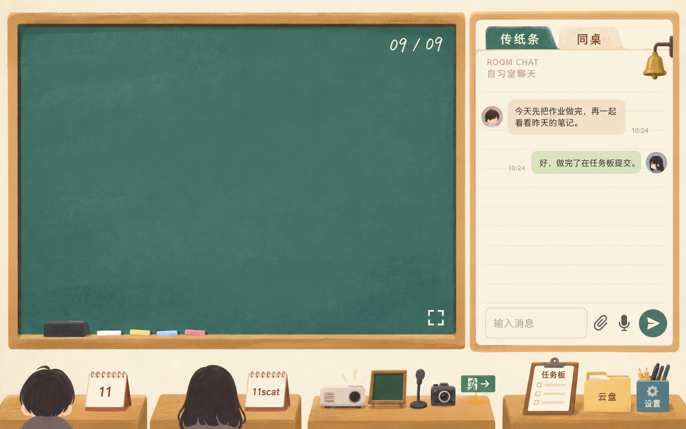
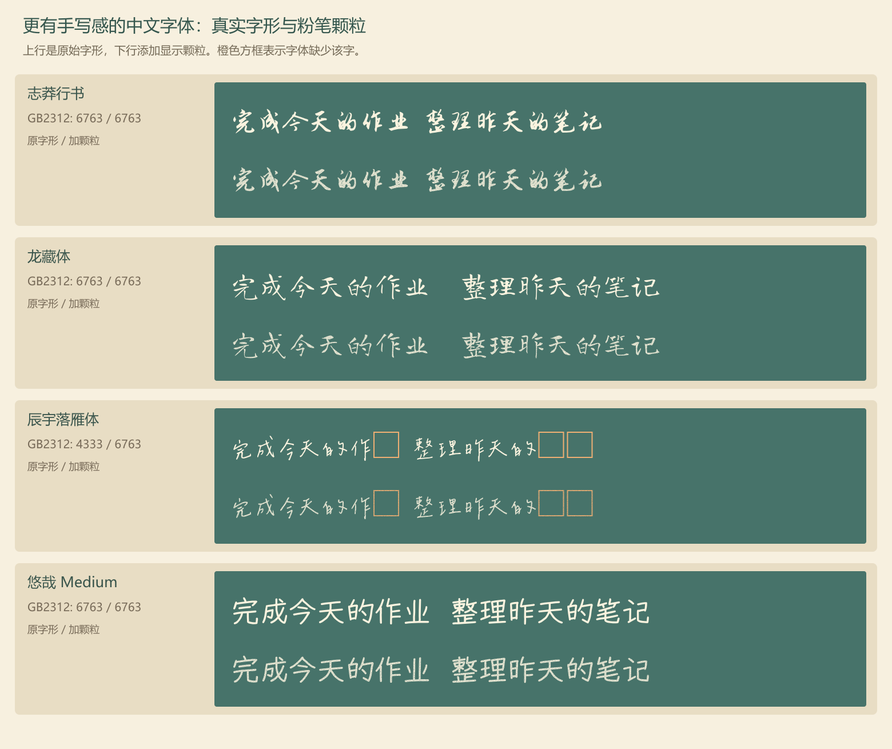

# 教室主题：固定材质基准、台历卡片与粉笔交互

日期：2026-09-09。本文按用户最新补充更新，颜色和细节质感以其再次指定的原图为唯一参照，替代后续已经发生色彩偏移的版本。个人卡片改回台历，中文字体改为比较更有手写感的免费字体，绘画选色入口移到左下方实物粉笔；这些要求已接入本地版本，按用户最新要求暂不上线。

## 固定的颜色与材质参照

这张原图用于固定灰绿色黑板、哑光赭黄木框、柔和纸张颗粒及各物件的明暗程度。后续不能以已经偏亮、偏艳或划痕较重的生成图作为新的材质参照，也不能因为更改局部物件而重设整体配色、木纹和纸面质感。

原图中的人物、旧说明文字和旧按钮排列不代表恢复这些已修改内容。最新明确的布局修改继续保留，英文日期仍采用 CHAWP；图中的纯数字日期仅属于原始参照。未被要求修改的形状、比例和材质应尽可能保持，每张新状态图都要与这张原图直接核对。

用户已明确取消重新生成整页效果图，并授权制作独立素材和代码实现。后续以实际本地页面评审，源图和完整提示词见[素材清单](classroom-asset-prompts-2026-09-09.md)；未经用户再次明确许可，外观改动不得推送或上线。

## 个人卡片改回台历

前两张课桌各放一个有螺旋装订和三角支撑的台历式卡片，直接参考原图已有台历的纸面与支架质感。卡片略微加宽以容纳用户 ID 和正在做的事情，不显示实际日期或日历网格，也不再使用书堆或人物背影。

自己的活动文字和直接编辑入口放在台历上，保留最长 80 字、Enter 保存、中文输入法组合保护、保存失败提示和成员同步逻辑。其他用户的活动文字维持现有只读权限；正在投影的成员以对应台历高亮表示，取消投影缩略图的决定继续生效。

## 中文任务与自由粉笔笔画

黑板待机时继续显示公共任务板现有排序中前面的少量标题，桌面先参考三条，按标题换行和实际面积调整。只复用已有公共任务数据，不新增轮询；这些字样不进入画板数据，也不提供新的快捷完成权限。

新的[手写字体与自由笔画报告](handwriting-and-freehand-chalk-2026-09-09.md)比较了志莽行书、龙藏体、辰宇落雁体及前轮悠哉。用户认可试写样例后，本地版本采用龙藏体加适量颗粒，英文日期保留 CHAWP。龙藏体完整转换为 WOFF2 并本地托管，授权文件随字体保留，不使用仅含示例文字的子集。

自由笔画可以使用同一套程序生成轻微起伏的笔迹边缘，并在笔迹内部添加固定颗粒，获得接近示意图的粉笔触感。其书写轨迹仍由鼠标、手指或触控笔决定，程序不会自动把随手画的线变成示意图里的特定曲线。已经提供[可直接打开的试写样例](assets/chalk-freehand-demo-2026-09-09.html)，它与正式网站独立，不读取真实账号或画板记录。

画板选色由黑板左下方已有的白、淡黄、浅蓝和粉色粉笔直接承接，点击某支粉笔后显示轻微选中状态。取消画板工具条中重复的固定颜色圆点，其他画笔工具继续保留；自定义颜色能力也保留，通过已有入口按需显示。左下方板擦继续承担擦除入口，实际画板的整笔擦除与局部擦除语义不变。

## 投影布与四种状态

投影布从整个画面的最顶端垂下，展开后覆盖黑板的绝大部分区域，并盖住顶部投影仪、日期和待机任务。材质使用柔和、哑光的浅色布面与轻微明暗，避免重褶皱、亮面或新的强纹理；不能沿用前一版露出投影仪、只覆盖黑板中段的小幕布方案。

布面收起后恢复原先被覆盖的物件。投影展开期间仍需保留结束共享与媒体切换的可操作入口，不能因投影仪被盖住而失去控制；台历和课桌物件位于覆盖区外。本地预览已接入展开和收起状态，桌面展开场景已在浏览器中检查；真实双人媒体播放仍待本地验收。

| 状态 | 当前要求 | 新版整页效果图 |
| --- | --- | --- |
| 待机与传纸条 | 台历卡片、中文粉笔任务、CHAWP 日期；纸条只有不规则边缘和轻微阴影 | 已取消生成，改看本地页面 |
| 投影打开 | 布面从画面最顶端垂下，覆盖黑板大部与投影仪，投影者台历高亮 | 已取消生成，改看本地页面 |
| 画板打开 | 黑板作为画布，隐藏待机任务与日期；左下方实物粉笔选色 | 已取消生成，改看本地页面 |
| 同桌打开 | 双方左右均分，只显示今天任务，活动编辑已移至台历 | 已取消生成，改看本地页面 |

## 继续保留的布局与功能要求

黑板与传纸条、同桌区域占据画面绝大部分面积，下沿对齐，四张课桌只露出少量桌面。第三张课桌用粉笔筒表示画板，保留麦克风及摄像头；第四张的任务夹板需要有可见支架，旁边保留黄色文件袋和设置文具盒。退出标识独立挂墙，与桌面之间有清楚空隙；投影仪及物件旁不添加独立名称纸签。

聊天消息从标签下方开始排布，删除原说明及其空白，不使用折角或卷边。输入框取消占位文字，附件和语音入口紧凑地放在发送入口上方，不添加已读回执。对同桌今天视图，两侧统一日期边界，处理现有 today 筛选还会带入历史逾期任务的差异，不扩大勾选权限。

英文日期继续使用[CHAWP](https://github.com/awp/chawp)，例如 WED, SEP 09，按北京时间更新；任务日期使用同一时区处理。绘画样例不改变正式画板的数据、多个画板选择、局部擦除和导出要求；正式接入需要复用一致的笔迹渲染规则，避免网页与导出的纹理表现分离。

## 当前交付与验证边界

固定参照、字体报告和独立试写原型继续保留。本地正式页面已经接入素材、台历、投影布、今天任务视图及可同步的颗粒笔迹，详细行为和检查记录见[本地实现说明](classroom-local-implementation-2026-09-09.md)。

本轮外观只在本地调试，没有推送或上线。平板截图被自动审批审查拒绝，未绕过限制重试；平板及真实设备完整验收仍保留在原需求表中，等待后续完成。
