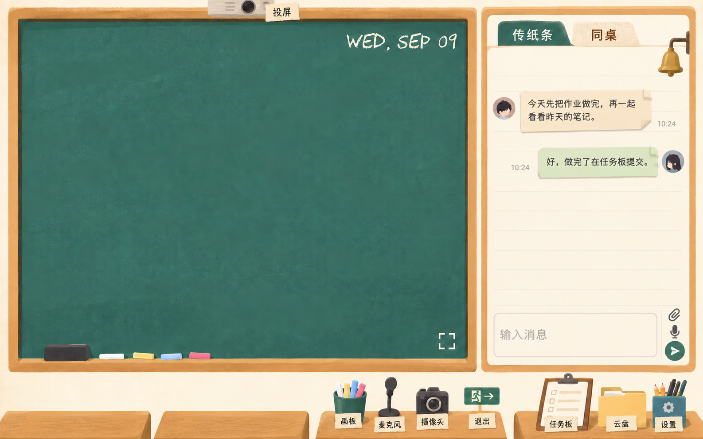

# 教室主题：手绘风格与英文粉笔日期

日期：2026-09-09。用户已选定 CHAWP，并同意使用英文日期。本说明已纳入最新七处标注，替代前轮偏写实插画、人物背影和台历卡片方案；本次只更新设计成果，尚未应用到网站。

## 当前效果图

三张用户参考图仅用于理解画面美术：用简化的手绘色块表达物件，配合柔和纸张颗粒和少量明暗。参考图中的文字、菜单、角色装饰及功能均不作为本站需求，不引入地图、专注倒计时或其他产品入口。

黑板与传纸条区域仍是绝对主体，在当前示意中延伸至画面约 85% 高度，下沿对齐。四张课桌只露出桌面与前沿的一小部分，两个背影已去掉，不展示座椅、桌腿或地板。前两张课桌暂时完全留空，原来的台历卡片也不作为当前方案；后续个人信息将通过桌面物品承载，具体采用什么物品由用户继续考虑，以便留出更多内容空间。

第三张课桌用装有白色、淡黄、浅蓝和粉色粉笔的笔筒表示画板，旁边保留麦克风、摄像头及退出入口，每个物件下均添加对应的中文名称。第四张课桌继续用任务夹板、黄色文件袋和文具盒表示任务板、云盘及设置。两张操作课桌的名称统一为带有手写感的纸签，文字仍然易于辨认；这是效果图中的字样设计，正式网页的中文字体文件尚未选定和接入。CHAWP 继续只承担英文日期，不用于缺少字形的中文名称。

投影仪从第三张课桌移到黑板上方，从画面顶缘露出下部和镜头，旁边保留投屏名称。它主要占据木框上沿，避免遮挡日期或大面积占用板面，不为此恢复顶栏。正式实现中，上方投屏入口及所有桌面物件都保留真实按钮与文字，不能把整张插画当作交互界面。

顶栏、中央图标和待机文案继续删除，木槽内保留板擦与粉笔。聊天标签下方的 ROOM CHAT 和自习室聊天两行说明已经移除，传纸条和同桌标签保留。每条消息使用独立纸条式气泡，通过微小的不规则纸边、折角和轻微阴影表达纸张，避免阴影与装饰妨碍文字阅读；不增加已读回执。图中沿用原示例消息，输入区的附件和语音入口仍位于发送按钮上方，整体靠右并缩小，为输入文本留出空间。

原有两个背影对应的男女形象与性别设置不再属于本次主题实施范围。个人卡片功能仍然需要保留，但其物品造型尚未决定；这一点不影响当前空课桌效果图的交付。

## 已选定的字体与日期格式

按用户决定使用 CHAWP，日期采用英文形式，例如 `WED, SEP 09`。对应含义为星期三、9 月 9 日；通过月份英文缩写避免纯数字日期的月日顺序歧义。只有日期改为英文，其他界面文字继续沿用已有中文。

上图直接使用 CHAWP 字体文件渲染，可作为正式实现的字形参考。整页效果图通过 imagegen 内置编辑工具在上一版设计上修改，属于视觉示意，不等同于浏览器实际加载字体后的截图。

重新检查字体字符映射后，数字 0—9、英文大写字母及日期所需标点均无缺失。包含这些字符的 WOFF2 试验子集为 40,092 字节，正式实现时可只加载日期子集，并保留原字体授权与来源。CHAWP 不含本项目需要的中文汉字，因此不让它承担中文聊天或任务标题。

字体来自 [CHAWP 作者仓库](https://github.com/awp/chawp)，[许可证](https://github.com/awp/chawp/blob/master/LICENSE)为 SIL Open Font License 1.1。已检查过的其他字体保留在[前轮调研](classroom-desks-and-chalk-research-2026-09-09.md)中供查阅，不再作为待选择方案。不能因自动匹配字体而重新换回 Chalk-S 或文楷。

实现时日期按用户设备本地日期显示，在跨日及页面重新可见时更新，无需服务器定时请求。投屏或摄像头画面出现时，投影布覆盖日期；切换画板沿用既有逻辑。该显示规则不改变任务时区或截止时间。

## 实施范围与验证

本轮逐项查看效果图，确认两行说明与两个背影已移除，前两张课桌留空，纸条气泡、粉笔筒、顶部投影仪以及物件名称均已呈现；黑板与聊天占比、CHAWP 日期、板擦和粉笔保持原方向。英文日期字符覆盖与实际字形验证沿用前轮结果，本轮未更换字体文件。未修改网站业务代码或真实账号，未调用摄像头与共享屏幕，也未删除聊天或工作流程数据。

实施仍需将背景和控制物件制作成独立素材，保留真实内容层，并根据窄屏调整控制区。第 14 处悬挂物件的指代尚未说明，仍沿用前轮待明确状态，本轮不重复询问，也不据此改变全屏入口。前两张课桌的个人卡片造型待用户确定后再加入，不提前用其他物品占位。
