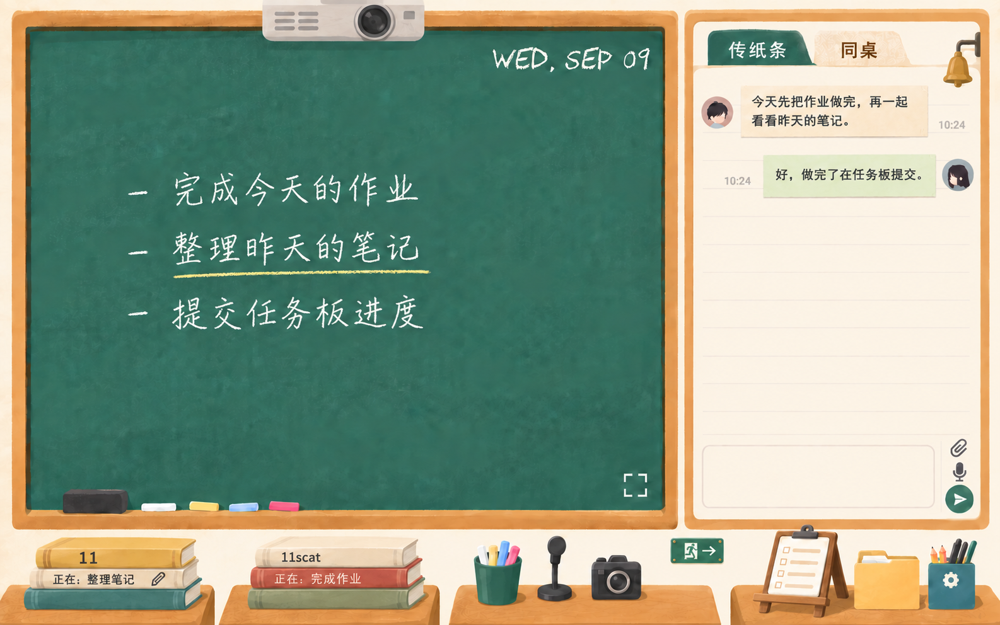
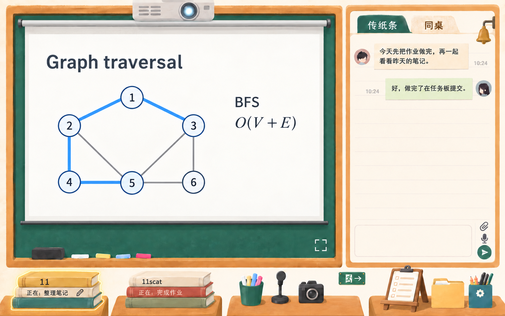
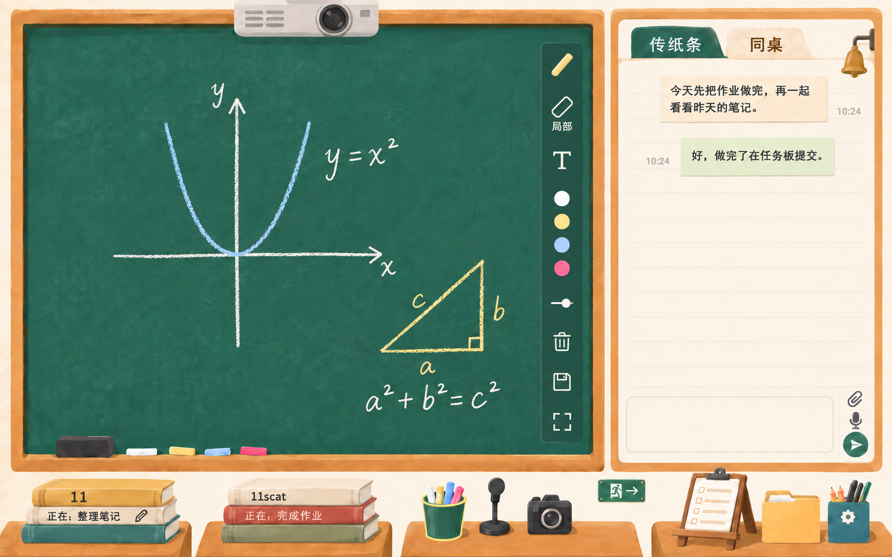
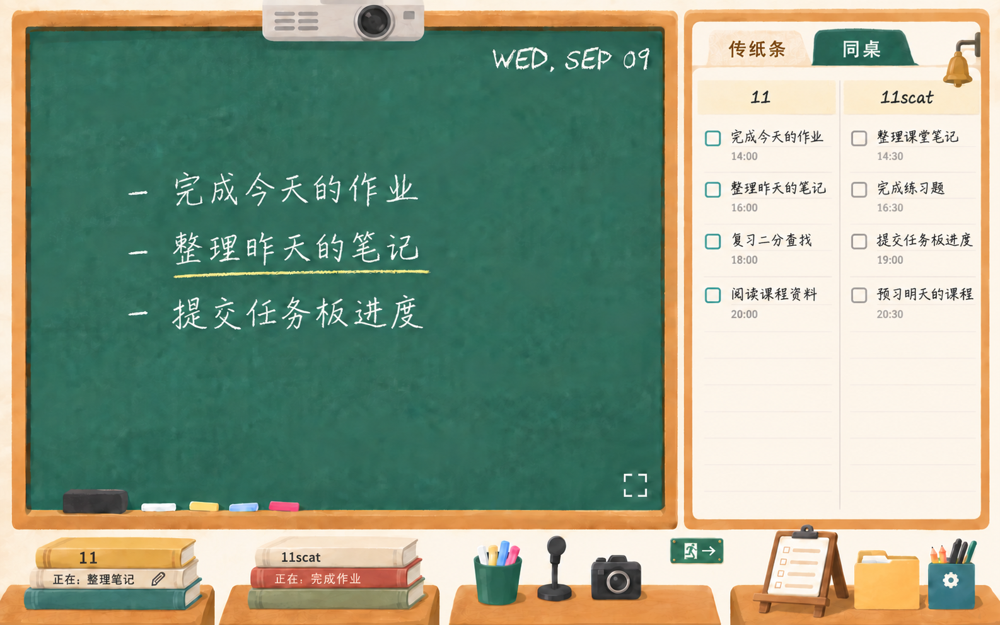

# 教室主题：书堆卡片与四种界面状态

日期：2026-09-09。本文纳入最新十二处标注，替代前轮空课桌、折角纸条和物件名称纸签方案。用户已确定用书堆承载个人信息；英文日期继续使用 CHAWP，中文粉笔字的实际候选与覆盖检测见[字体调研报告](chinese-chalk-font-research-2026-09-09.md)。本轮交付为效果图与实施说明，尚未修改网站界面。

## 四张效果图

四张图使用同一套平面手绘色块、柔和纸感和木框比例。黑板与右侧面板占画面约 85% 的高度，四张课桌只在下沿露出少量；不出现人物背影、桌腿或地板。图中的任务、活动状态、时刻和投影内容均为排版示例，不代表读取了当前账号数据。

### 待机与传纸条

没有任何投影、摄像头画面或画板时，黑板直接以粉笔字显示公共任务板前面的少量任务。当前桌面效果图先排三条，保留较大的行距与空白，英文日期位于右上角；原先的中央标语、图标和开始共享按钮仍不恢复。

传纸条面板的消息紧接标签下方排列，删除原说明区的空白。气泡只使用略微不规则的纸边与轻微阴影，没有折角或卷边；输入框不显示占位提示，附件、语音和发送入口仍紧凑地排列在右侧，不增加已读回执。

### 投影打开

投影布从黑板上方展开，完整覆盖任务和日期，板面边缘与木槽内的板擦、粉笔仍可见。顶部投影仪适当增大，通过镜头、机身和散热孔表达物件特征，不附文字纸签；关闭投影时布面收起，回到对应的待机或画板状态。

图中 11 的书堆采用金色边缘高亮表示其正在投影，原来的投影缩略图不再显示。书堆的 ID、活动文字和状态编辑入口始终位于投影覆盖区之外，其他桌面控制也不会被投影布遮挡。

### 画板打开

画板使用绿色黑板作为画布，显示用户笔迹时隐藏公共任务与待机日期，不铺白色投影布。图中采用白、浅蓝和淡黄粉笔绘画，右侧紧凑工具条对应现有的画笔、擦除、文本、颜色、粗细、清屏、保存及全屏功能，第三张课桌上的粉笔筒显示选中状态。

粉笔质感只改变视觉表现，现有局部擦除、整笔擦除和导出逻辑仍需保持。公共任务文字不能写入用户画板数据，也不能被清屏操作删除；清屏仅影响当前画板。实际实现仍要保留自定义画笔颜色、多个画板的选择和媒体切换能力，静态图中的几个色块及单张画板不代表删去这些功能。

### 同桌打开

侧栏左右均分为两列，以 11 和 11scat 区分用户，只显示双方今天的任务。删除今天、七天及无日期范围切换，状态文字与编辑入口移到书堆；任务列表因此可以使用侧栏的完整高度。截图中的对方列表使用灰色状态框，不扩大已有勾选权限。

同桌与主显示区是独立的选择：这张图搭配待机黑板，也可以与投影或画板同时出现。它不会重置主显示区的内容或停止正在进行的共享。

## 十二处标注的对应处理

| 标注 | 当前设计 |
| --- | --- |
| 1 | 删除投影仪旁的投屏纸签，保留可识别的投影仪物件。 |
| 2 | 纸条气泡去掉折角，仅保留轻微不规则边缘与光影。 |
| 3 | 投影仪适当增大，显露镜头、机身和散热孔，仍仅占黑板顶部少量区域。 |
| 4 | 删除桌面物件旁的名称纸签，功能名称留在实际按钮的辅助名称与按需提示中。 |
| 5 | 退出标识独立挂在墙上，与课桌之间保留清楚的空隙，不使用立柱或桌面底座。 |
| 6 | 分别提供投影展开和画板打开效果图。 |
| 7 | 两个用户各以一堆书表示，书脊显示 ID 和当前活动；自己的活动可在这里编辑，投影者书堆高亮，取消投影缩略图。 |
| 8 | 任务板改为带前托条和可见后支脚的桌面小画架，能合理立在桌面上。 |
| 9 | 去掉聊天输入框的占位文字，输入框仍可正常聚焦和输入。 |
| 10 | 消息区向上使用原说明区空间，不保留空白标题区。 |
| 11 | 待机时直接以中文粉笔字显示公共任务板前面的少量任务，附实际字体调研与字样对比。 |
| 12 | 提供同桌效果图，侧栏只显示双方今天的任务，不保留日期范围切换。 |

## 书堆卡片与现有逻辑

每个用户对应一堆低矮、宽书脊的书，ID 与正在做的事情直接写在书脊内容层，避免再贴独立纸签。自己的活动文字旁保留一个小铅笔入口，点击活动文字或铅笔后原地输入；继续沿用现有最长 80 字、Enter 保存、中文输入法组合状态保护、保存失败提示和成员同步逻辑。他人的活动仍按现有权限只读，不因为改为书堆而获得编辑权限。

投影高亮只表达媒体状态，不改变用户填写的活动文字。多人同时共享时，各自对应书堆可保持高亮，点击书堆的非编辑区域沿用媒体选择逻辑；编辑活动文字不能触发切换。一个用户有多路媒体时，通过按需出现的简洁列表选择，仍不恢复常驻缩略图；此列表属于后续实现说明，本轮未绘制其展开状态。

第三张课桌保留粉笔筒、麦克风与摄像头，退出入口移到墙面。第四张课桌用带支架的任务夹板、黄色文件袋和文具盒表示任务板、云盘及设置；物件都需要真实按钮与足够的点击区域，不能把整张插画当作网页交互层。人物形象已取消，不再因该形象增加性别设置。

## 待机任务与字体使用

待机任务复用公共任务板当前的任务数据与现有排序，只展示前面几条的标题，不额外读取个人收集箱，不添加另一套轮询。桌面先以三条为参考，正式布局按实际板面高度和标题换行情况减少条数；不压缩到难以阅读的字号，也不循环滚动或自动翻页。任务为空时保留日期与空黑板，不恢复中央说明文案。

这些文字只用于展示公共任务，不提供新的快捷勾选途径，完成操作继续遵守既有认领和审批权限。点击标题如需进入对应任务，应沿用原任务板入口与详情行为；图中的短横线只是粉笔列表符号。

英文日期继续使用 [CHAWP](https://github.com/awp/chawp)，按设备本地日期生成，例如 WED, SEP 09，跨日或页面重新可见时更新。它不影响滴答待办时区；同桌移除侧栏日期范围切换入口，协作弹窗中的其他日期视图不受影响。

代码核对发现，现有 today 筛选以今天作为日期上界，还会包含以前未完成的任务。正式落实只显示双方今天时，两侧需要统一按 Asia/Shanghai 的今天日期边界筛选，避免直接隐藏切换按钮后仍混入历史逾期任务；截止日或开始日的取值规则沿用现有数据字段。这是待实施的行为要求，本轮尚未改动筛选代码。

中文任务的推荐候选为悠哉 Medium 配合适度粉笔颗粒显示，小赖作为另一种字形选择。二者是手写字体，颗粒是另加的显示效果；整页生成图中的中文粉笔字为视觉示意，不能当成某个字体文件的精确字形。最终字形仍以[实际字体对比](assets/chinese-chalk-comparison-2026-09-09.png)为依据，不改动已经确定的 CHAWP 日期。

## 验证与实施边界

四张效果图均由 imagegen 内置工具编辑并逐张检查；待机图针对纸角与任务板支架做过局部修正，其余状态均由同一版待机图派生。字体样张直接读取下载字体的字形轮廓，另行标注颗粒模拟，检测报告保留字形覆盖与文件摘要。原始提示词与下载中间文件置于项目的 codex-generated/classroom-v3 目录。

本轮仅更新图片、说明和原需求表，没有修改网站代码，也没有访问或变更真实用户任务。正式实施仍包括独立素材制作、触控与窄屏布局、活动编辑迁移和媒体状态同步，并验证工具及导出行为；未完成项继续保留在原需求表中。铃铛暂沿用当前图的右上角位置，早先第 14 处悬挂对象若另有所指，需再按用户说明调整，不据此更改全屏入口。
