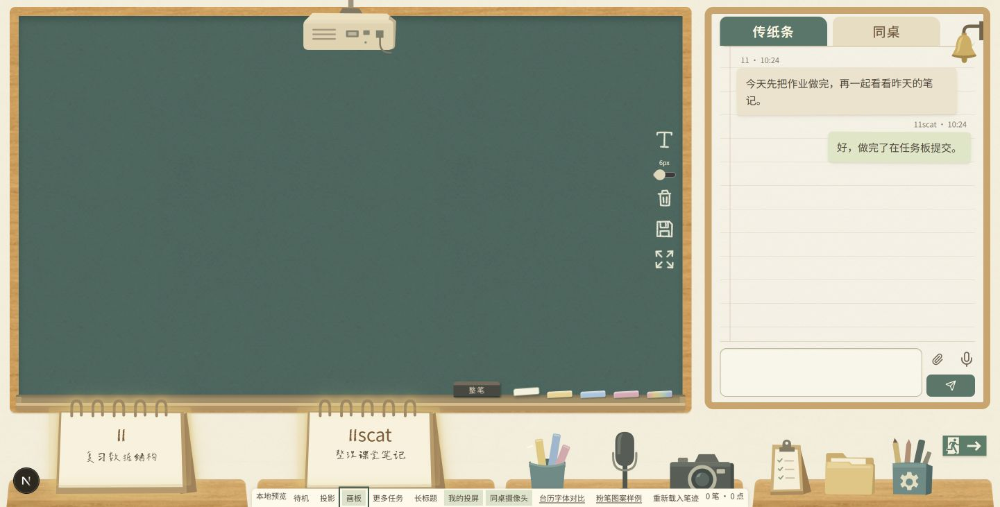
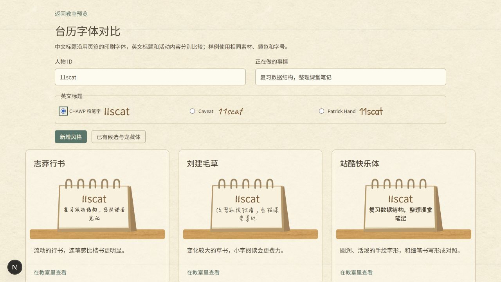
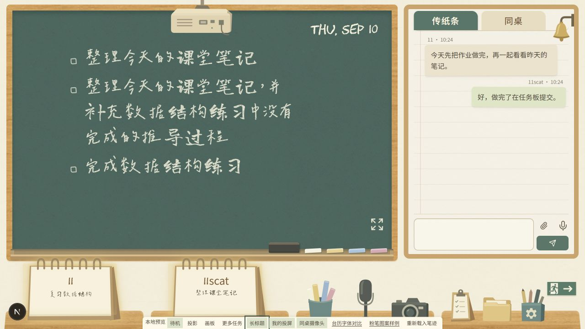
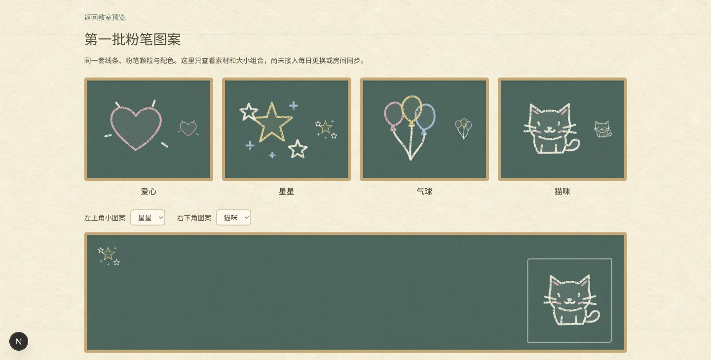

# 教室主题第四轮本地批注

本轮工作保存在 `codex/classroom-local`，仅供本地查看，未推送或部署。已经确认的课桌物件、投影仪、台历及纸张素材沿用原文件；新增的是粉笔工具与装饰图案、字体候选，以及用户要求的托槽外观和布局调整。

## 查看入口

- [教室预览](http://127.0.0.1:3008/classroom-preview?calendar=yan)：底部工具可以试用长标题，并独立开启两个台历的媒体高亮。
- [台历字体对比](http://127.0.0.1:3008/classroom-preview/fonts)：分别比较英文标题和活动文字，输入的样例内容会同步到所有台历。
- [粉笔图案样例](http://127.0.0.1:3008/classroom-preview/chalk-art)：查看四款图案的大、小版本和位置组合，不读写真实房间。

## 18 处批注对应处理

| 批注 | 当前本地行为 |
| --- | --- |
| 1 | 托槽位于画板工具之后，粉笔与板擦上移；桌面重叠随可用宽度变化，台历透明边缘不再拦截后方工具。 |
| 2 | 当前用户和同桌各自根据投屏或摄像头状态高亮，允许两个台历同时亮起；折起幕布不会错误清除仍在共享的状态。 |
| 3 | 相邻消息的统一间距从 10 改为 5 像素，保留原纸条素材。 |
| 4 | 含中文的台历标题沿用页签印刷体；英文和数字默认试用 CHAWP，另提供 Caveat 与 Patrick Hand。 |
| 5 | 新增志莽行书、刘建毛草、站酷快乐体，并保留文楷、马善政、落雁体和龙藏体对比。标题与活动文字可以分别选。 |
| 6、8 | 移除侧边画笔和橡皮入口，点粉笔进入绘画，点板擦进入擦除。 |
| 7 | 板擦上添加低对比的小字“整笔 / 局部”；选中板擦后再次点按切换模式，改用粉笔后仍记住原擦除模式。 |
| 9、12、13 | 文本、清屏和保存入口使用同一组颗粒粉笔图案，保留原功能。 |
| 10 | 自定义颜色改成一支彩色粉笔，和常用粉笔一起放在下沿；使用系统颜色选择器。 |
| 11 | 下沿暂改为浅托槽，包含后沿、凹槽与前唇，使用当前木色和简化色块。用户提到的额外底框例图尚未收到，因此这部分仍待参考图复核。 |
| 14、15 | 画板和待机黑板共用新粉笔全屏图案，投影状态继续使用原普通图标。 |
| 16 | 任务区域右侧留出图案空间，文本完整换行；根据实际排版高度决定显示的任务数量，末条不能完整放入时整条不显示。 |
| 17 | 爱心、若干星星、若干气球和猫咪素材已绘制，大小版本共用源图。仅提供组合样例，暂不实装每日更换、点击选择及房间同步。 |
| 18 | 桌面四张课桌统一等宽，手机保留两列两行，物品继续按素材原比例显示。 |

第 10 处批注的目标是工具栏容器。结合相邻批注明确要求保留文本、清屏和保存操作，本轮将其中的自定义颜色入口移到下沿，并去除侧边工具栏背景；其余粉笔图案操作及粗细控件仍在黑板右侧。

## 排版和交互取值

桌面任务区域左侧为黑板宽度的 15.38%，右侧为 23.84%，底部留 83 像素，以对应批注中的横向留白和下移空间。手机继续采用原有较宽的文字区域。标题取消三行限制；如果第一条任务本身就高于整个区域，会显示带键盘焦点的滚动区域以阅读完整名称，不截断原文。

四桌等宽后，在 1366 像素及以下的双栏窗口中取消桌面与黑板的负间距，在 1366–1536 像素之间平滑恢复重叠，最多 34 像素。这样可以避免台历遮住托槽上的板擦，同时在宽屏保留前景层次。透明台历外缘不接收指针，实际文字和表单区域仍可操作。720 像素及以下继续上下布局。

字体候选使用 SIL OFL 1.1，允许按许可条件嵌入网页和商业使用；原许可文件随字体保存。中文候选采用常用字网页子集，缺字使用后续字体。准确来源、版权和派生名称见[素材署名](../public/classroom/ATTRIBUTION.md)，图案后续维护要求见[粉笔素材说明](../public/classroom/chalk/README.md)。

## 本地验证与待验收范围

生产构建和教室相关五项测试通过，相关静态检查无错误，首页保留既有四条警告。构建首次遇到原有 Geist 字体下载失败，重试后完成，本轮没有修改该字体。

浏览器已确认白粉笔真实绘制、整笔擦除和切换局部模式，两个台历可以同时高亮。检查了 1441、1166、1000 和 390 像素宽度的布局，另针对 1280 像素发现的板擦遮挡补充了修正和复核。1441 像素下四桌均为 338.25 像素，390 像素下各桌均为 171.5 像素，没有页面横向溢出。长标题样例完整换行，最后一条长标题空间不足时整条省略；字体页的中文标题与英文候选切换、图案页两处独立组合均已在浏览器检查。

未调用系统取色窗口，也未请求真实摄像头或投屏权限。真实双人媒体和真机触控仍需本地验收；此前平板截图被自动审批审查拒绝的项目维持未完成，本轮没有重试或更换控制方式。字体最终选择、额外托槽参考图和整体验收仍由用户后续反馈决定，装饰图案同步按明确要求留待后续实现。

