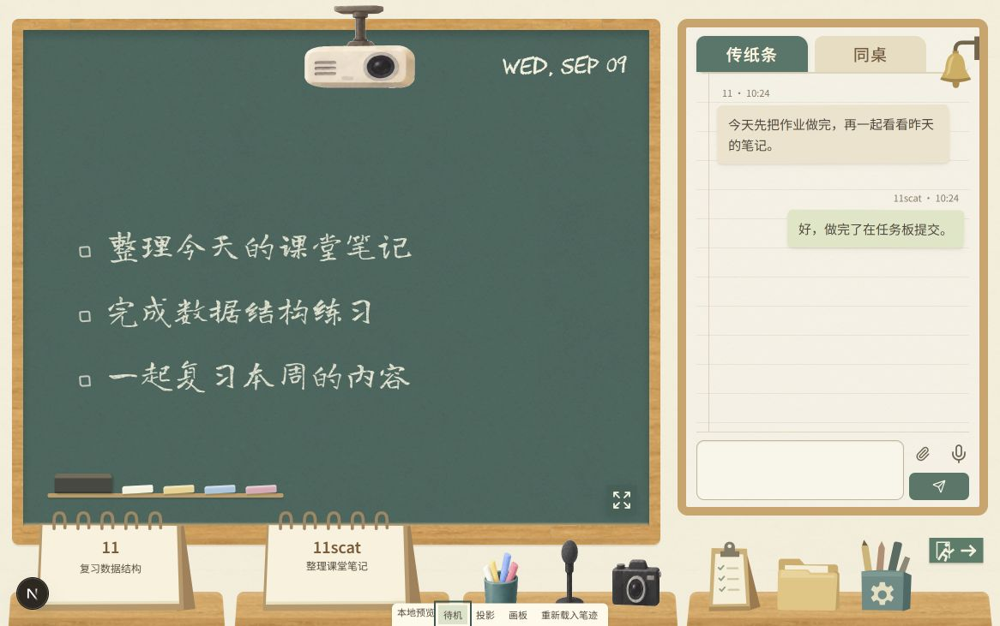

# 教室主题：纸面、物件与布局调整

本轮依据九处浏览器批注及用户补充的聊天纸面参考实施。所有内容只保存在本地分支 `codex/classroom-local`，不推送、不部署；整体外观仍待用户查看实际页面后验收。

## 参考范围

整体颜色继续以 [已确认参照](assets/classroom-approved-material-reference-2026-09-09.png) 为准。本轮补充的 [聊天纸面参照](assets/classroom-chat-paper-reference-2026-09-09.png) 只用于聊天区域的暖色纸底与横线、左侧页边线，不采用其中已取消的人物、文字或布局。

下面为本轮实际网页截图，使用示例数据，底部小工具条仅在本地预览中显示。

## 素材与字体调研

| 方案 | 核对结果与选择 |
| --- | --- |
| [Noto Sans SC](https://github.com/google/fonts/tree/main/ofl/notosanssc) | OFL 字体，有连续字重。用于按钮和台历等界面文字，正文 400、按钮 500、名称 600，减少细小文字的笔画差异。网页本地提供字体，保留授权文件。 |
| [Noto Serif SC](https://github.com/google/fonts/tree/main/ofl/notoserifsc) | OFL 字体，具有教材宋体风格。本轮未采用，其笔画粗细变化在小按钮上会更明显。 |
| [站酷小薇体](https://github.com/google/fonts/tree/main/ofl/zcoolxiaowei) | OFL 字体，公开版本为单一 400 字重。适合另行评估标题，本轮需要名称、正文和操作文字的不同字重，因此未采用。 |
| [Black Paper](https://www.transparenttextures.com/black-paper.html) | Atle Mo 制作的细颗粒纸纹，CC BY-SA 3.0。实际查看后选择其微小颗粒作为黑板表面纹理，绿底与反差由代码控制；它并非黑板实拍照片。 |
| [ambientCG Paper001](https://ambientcg.com/a/Paper001) | CC0，来源将制作方法标为高度场摄影测量。采用颜色贴图，用低反差暖色覆盖作为聊天纸面；不加载法线、粗糙度等立体光照贴图。 |

ambientCG 的 `chalkboard` 检索没有返回专用材质。此次采用可核实授权的细颗粒替代原生成黑板上的大块明暗变化；页面与画板导出均使用同一张纹理，颜色仍保留既有的 `#426e63`。文件与完整署名见 [素材授权](../public/classroom/ATTRIBUTION.md)。

中文黑板书写继续使用龙藏体与粉笔颗粒，英文日期继续使用 CHAWP。界面按钮和台历不再使用这两种手写字体；字体子集含 GB2312 与配套字符，共 8,654 个字符，生僻字由系统印刷字体补充。

## 已接入页面的调整

右桌的任务夹板、文件袋、设置笔筒及墙铃改用少量色块组成的矢量图形，保留支架、文件夹页签和齿轮等辨识特征。新台历正面接近平视，支架只露出窄侧面，内容区与字体方向一致；桌面位置不变，台历向上增加高度。

退出入口改用绿底疏散标识，直接挂在场景右侧墙面，继续触发原退出流程。右桌物品向左移，给墙面标识留出空间；标识没有放在桌子节点中，手机上位于两排课桌之间的空白区域。

聊天背景采用暖米色纸纤维，约 34 像素间距的浅横线与一条淡页边线。纸条气泡保留原来的两种色调，只有轻微不规则边缘和投影，不增加折角、已读状态、说明文字或输入占位文字。

## 布局取值

1166×731 的批注尺寸下，黑板实测约 **755.84×614.05**，聊天面板宽约 **362.16**。通过桌面两侧留白 14 像素、主栏比例 2.087:1 与 34 像素的前景重叠取得，不固定整页宽高。

桌面宽度大于 1000 像素时，黑板向下进入课桌物件后方；721–1000 像素时重叠量减为 26 像素。720 像素及以下继续使用黑板、聊天区上下排列与两排课桌，取消纵向重叠。聊天面板高度保留输入区所需空间，前景空白部分不截获指针事件。

台历向上增加高度后，粉笔与板擦放在略高的小托条上，避免被台历覆盖；全屏及手机布局恢复靠近板沿的位置。课桌和物件显示在前方，画板颜色按钮仍可点击。

## 本轮验证

- 本地生产构建和 TypeScript 检查通过，指定文件的静态检查无错误，保留首页原有四条警告。
- 教室相关五项检查通过，粉笔绘制的像素验证通过，包含白色笔迹、重绘、擦除与版本重置。
- 浏览器检查了 1166×731 桌面布局、投影覆盖、同桌界面和 390×844 手机布局；手机页面没有横向溢出。粉笔颜色按钮、台历及墙面退出标识的中心点均未被其他元素遮挡。
- 投影完成展开后，从页面顶端覆盖投影仪和黑板主体。预览使用示例数据，未操作真实账号任务或消息，也未触发铃声。

本轮没有重新执行之前被自动审查拒绝的平板截图。平板完整检查与真实设备、真实双人媒体验收继续保留在原需求表中。
