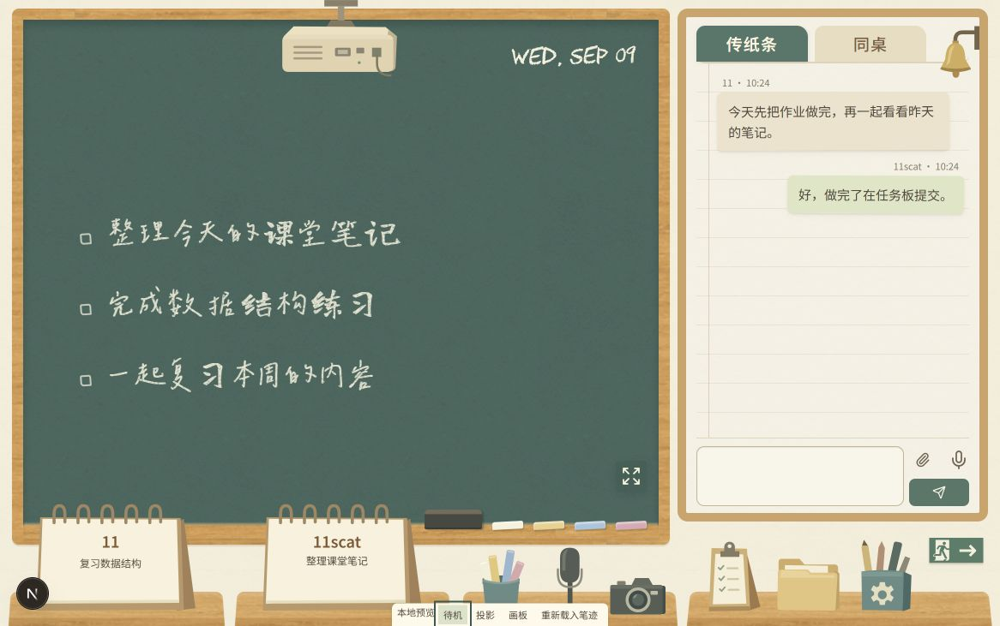
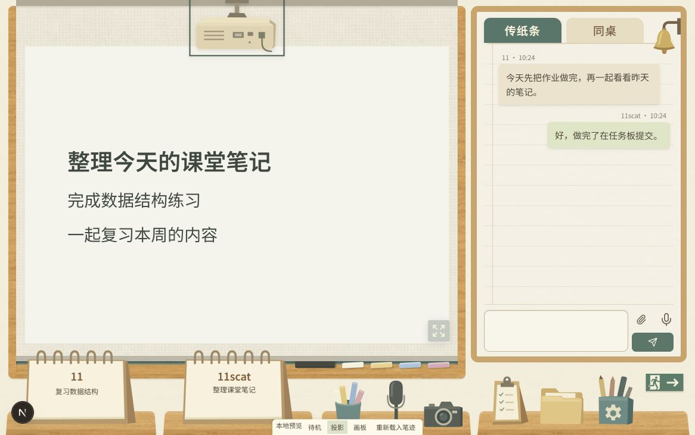

# 教室主题第二轮本地批注

本轮合并处理恢复预览之前的五处意见及之后的六处意见。外观修改继续仅在本地分支 `codex/classroom-local` 保存，不推送、不部署，既有外观验收与发布许可要求不变。

## 素材范围

第四桌的任务夹板、文件袋和设置笔筒保持上一轮源文件不变，铃铛也保持不变。已比较文件哈希，确认这些图形及原图集、原图集遮罩没有被重新生成或覆盖。

第三桌重画粉笔筒与麦克风，相机使用宽身轮廓和少量色块，配色与第四桌一致。所有物件都以原始宽高比容纳到各自入口中；台历去掉强制拉伸，其图形路径不变，内容与图源共享一个固定比例的容器。素材不再随按钮框分别缩放宽高。

紧急出口的小人和门依据 Wikimedia Commons 上 MaxxL 提供的 [ISO 7010 E002 示意图](https://commons.wikimedia.org/wiki/File:ISO_7010_E002.svg) 调整，该源图由作者置于公共领域。新的横向标识保留既有的绿色和米白色，以及向右箭头，仍在墙面上显示。

投影仪按用户最新要求改为背对观看者，背面有概括的通风孔和接口，不显示正面镜头。当前消息附件中没有出现用户提及的两张投影仪参考图，本版依据通用背面结构制作，后续收到例图可继续核对。素材署名和字体许可见[授权说明](../public/classroom/ATTRIBUTION.md)。

## 字体与粉笔

用户所说的另一个“鸿雁体”，按此前对照过的辰宇落雁体理解，本地已改为试用辰宇落雁体 2.0 Thin。保留粉笔颗粒，待机文字增加轻微描边以便阅读，画板文字的显示和导出采用同一字体顺序。

这套字库包含 10,137 个映射字符，但简体覆盖仍不完整；当前示例中的“习、笔、练、结、记、课”由龙藏体补充。任务文字本身不转为繁体，日期继续使用 CHAWP，按钮继续使用印刷字体。网页版本按原许可保留版权说明，并更名为 Classroom Yan，以遵守原字库的保留名称条款。

板擦与粉笔移到黑板右下角，直接靠在既有木边上，删除上一轮为避让台历而升高的小托条。较窄桌面适当等比缩小整组粉笔，手机和全屏下保持正常工具尺寸。

## 布局和消息

在 1166×731 的批注尺寸下，黑板实测约 **766.84×626.05**，聊天面板约 **362.16×599.05**；两块区域顶部均为 10 像素，间距为 9 像素。聊天宽度沿用上一轮比例，减少的间隙空间用于加宽黑板，聊天区下沿额外延长约 7 像素。

上述尺寸通过容器比例和间隙取得，没有固定整页像素。721–1000 像素沿用双栏布局并将间隔设为 8 像素，720 像素及以下沿用上下布局。手机的两排课桌之间为出口标识留出墙面空间。

消息之间去掉原有的 20 像素外边距，列表统一使用 10 像素间隙，名称与纸条之间由 6 像素缩到 3 像素。纸面纹理、气泡配色和正文大小保持上一轮样式。

## 投影操作

投影仪在幕布展开和收起时都显示于前方，点击它即可在两种状态之间切换。收起只隐藏本地观看区域，公共任务文字重新显示；再次展开恢复当前来源，不结束双方正在共享的媒体。

结束共享、关闭摄像头的原入口仍保留，观看对方画面时也仍能从幕布内开启自己的屏幕共享。点击用户台历会重新展示对应画面；出现新的媒体来源时不会继承旧来源的收起状态。画板打开时点击投影仪可切回已有画面；没有媒体时开启共享选择，成功共享后才切离画板。预览与首页复用同一个幕布状态逻辑和投影仪按钮。

## 验证

生产构建及 TypeScript 检查通过，相关文件静态检查无错误，保留首页已有的四条警告。教室相关五项检查与粉笔像素验证通过，未改变自由笔画的协议或擦除逻辑。

浏览器确认投影仪展开后仍在前方，点击能收起并再次展开；1166 和 1000 像素宽度下检查了粉笔与台历的点击范围，390 像素宽度下检查了工具边界与横向溢出。使用的是无真实账号操作的预览，真实双人媒体与设备触控仍待本地验收；没有重新执行此前被拒绝的平板截图。

