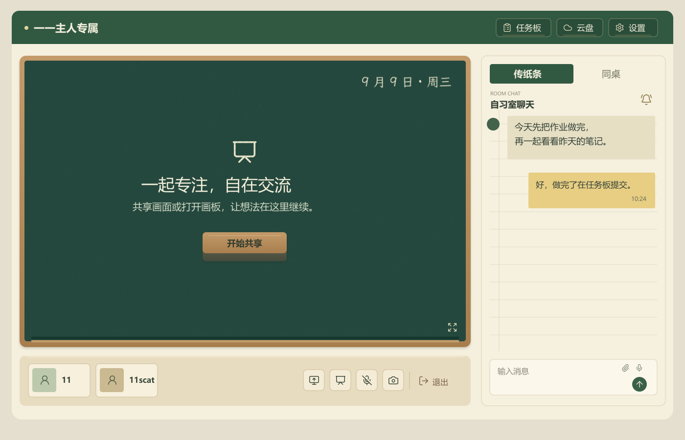
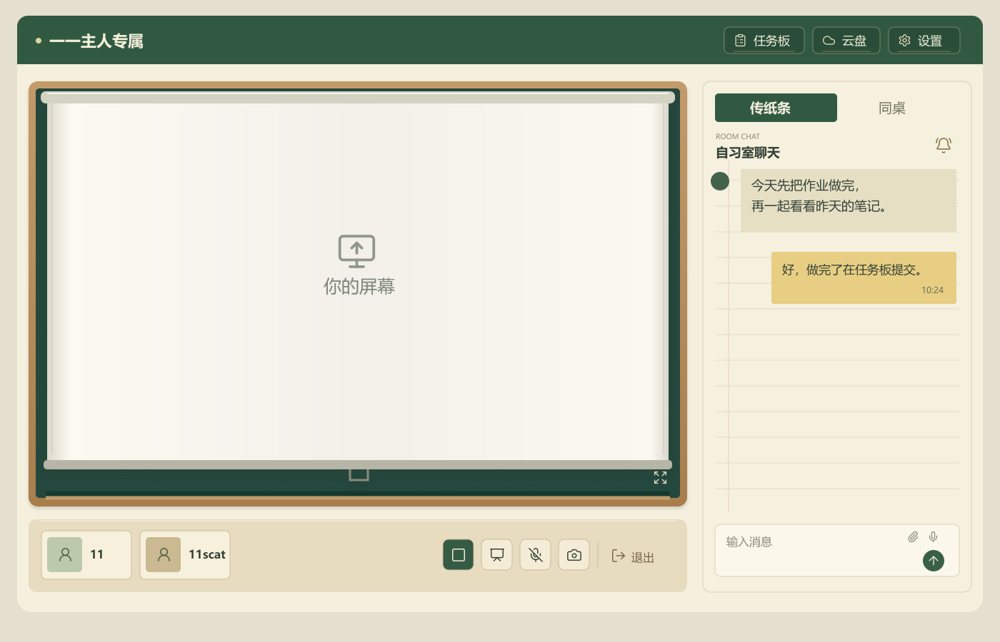
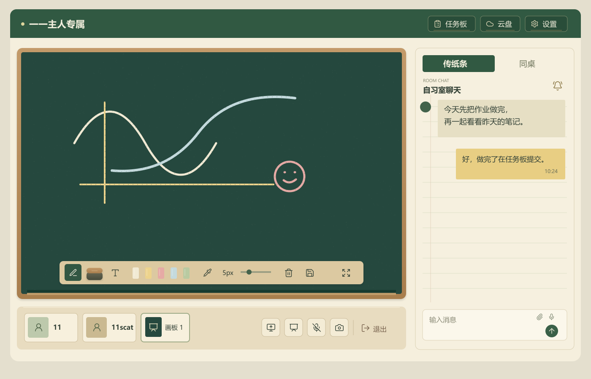

# 晨间教室外观细化与人物区域布局

日期：2026-09-09。根据用户最新九处批注更新设计示意，沿用现有网站文案与功能；本次交付外观方案和可点按的投影布动画示意，尚未修改网站界面。教室方向已经确定，人物卡片的最终位置仍在讨论。

## 推荐布局

人物卡片移到黑板下方的固定托盘，左侧保留人物与画板缩略卡，右侧容纳现有共享、画板、麦克风及摄像头控制，退出放在最右侧并留出间隔。托盘属于主显示区，但位于黑板木框之外，投影布只在木框内部展开，所以共享和摄像头画面都不会遮住人物卡片及控制按钮。

该方案同时腾出原本上方人物栏的高度，把可用高度交还主显示区。与人物卡片悬浮在投影上方相比，它不会遮挡文字、代码和摄像头画面；也避免在聊天上方占用额外空间。人物或画板较多时，托盘左侧可以横向滚动，右侧控制保持固定。手机窄屏将托盘调整为两行，人物在上、操作在下，点击区域保持足够大小；本次桌面示意未代表手机实机验收。

## 待机黑板

左上角恢复现有的“一一主人专属”。黑板中央沿用“一起专注，自在交流”及“共享画面或打开画板，让想法在这里继续。”，不添加“今日课堂”“课后计划”或其他栏目。日期为用户本次要求增加的唯一常驻信息，拟显示本地当天日期并在跨日及页面重新可见时更新。

顶部任务板、云盘、设置采用相同的浅金细边教室铭牌样式，保留可理解的原功能图标与现有文字。当前示意没有新事件，因此不显示任务板数字；真正实现时继续使用既有未读事件计数。

“开始共享”做成浅木柄与深色毡面的黑板擦外形，点击仍执行开始共享。画板里的实际擦除工具也采用黑板擦外形，但保留原有擦除提示，避免变更原操作含义。

聊天保留纸面与淡横线，消息块使用浅纸色及低饱和黄。图中的两句消息沿用用户所附图片，仅用于示意，不会作为新消息写入网站；输入提示恢复网站原有的“输入消息”。保留时间，去掉“已读”，不新增聊天已读回执功能；任务板原有的动态已读计数不受影响。

## 投影展开

共享屏幕与摄像头共用同一块投影布。首次出现媒体时，布面由上方展开；没有媒体可显示时收起。日期和待机文字位于布面后方，展开后全部遮住。图中“你的屏幕”仅为已有媒体名称占位，实际显示当前媒体画面，不在画面中央额外叠加说明。

实现时布面移动只改变可见区域，视频内容保持原比例，不随动画被纵向拉伸。存在多个媒体源时，切换源不反复收放投影布；关闭自身共享后若仍有对方画面，应继续展示对方画面。小窗、共享音频及画面切换等现有入口保留，样式再与布面边缘统一。

动画建议约 450—550 毫秒，使用浏览器合成动画并适配减少动态效果的系统偏好。可以打开[交互示意页](assets/classroom-refined-interactive-2026-09-09.html)，点按下方共享或摄像头图标查看展开、收起，点按画板图标切换画板，人物卡片用于返回。它不接入摄像头或网站数据，实际动作仍由现有网站负责。

## 黑板画板与粉笔素材

画板保持现有新建、切换、删除与多人同步方式，不把待机黑板自动变成一张需要保存的新画板。打开画板时显示深绿画布，工具提供米白粉笔、浅黄、淡粉及灰蓝色，并保留自选颜色；淡绿可作为补充预设。图中笔迹仅为视觉示意，不会写入用户画板。

日期示意实际使用了[霞鹜文楷](https://github.com/lxgw/LxgwWenKai)的字形。该字体由 Klee One 衍生，采用 [SIL Open Font License 1.1](https://github.com/lxgw/LxgwWenKai/blob/main/OFL.txt)，允许在遵守授权条件的情况下使用和嵌入。它提供手写字形，粉笔颗粒由本项目绘制的轻微纹理叠加实现，不把毛笔字体直接当成粉笔字。最终网站可仅为日期字符制作网页字体子集，并保留授权文本，避免加载本次调研下载的完整字体文件。

黑板表面使用很浅的颗粒与擦拭痕迹，粉笔笔迹只加轻微的不均匀透明度。正文与按钮文字不叠加强噪点，聊天继续使用清晰的界面字体。日期纹理及粉笔笔迹的颜色要保持足够对比，不能为了材质感使细笔画消失。

当前画板的局部擦除使用白色笔迹覆盖，导出图片也填白底，因此正式实现需要一并修改。建议为后续擦除记录区分擦除语义，以透明遮罩恢复黑板背景；旧画板保留原数据，并为历史白底及深色笔迹提供兼容显示，不能直接把用户原有颜色整体改写。导出需同时应用黑板背景及同样的粉笔效果，避免屏幕显示与保存图片不一致。相关现有代码为 `app/Whiteboard.tsx`。

## 本次交付边界

三张图已逐一检查文字、按钮位置与覆盖范围，动画示意的独立脚本已做语法及状态切换检查。未对生产网站进行操作，未改摄像头、投屏或画板数据逻辑；动画示意未进行真实浏览器交互验收。推荐采用下方托盘的人物布局，后续只需继续调整这一个布局方案，不必再从不同颜色候选中选择。
