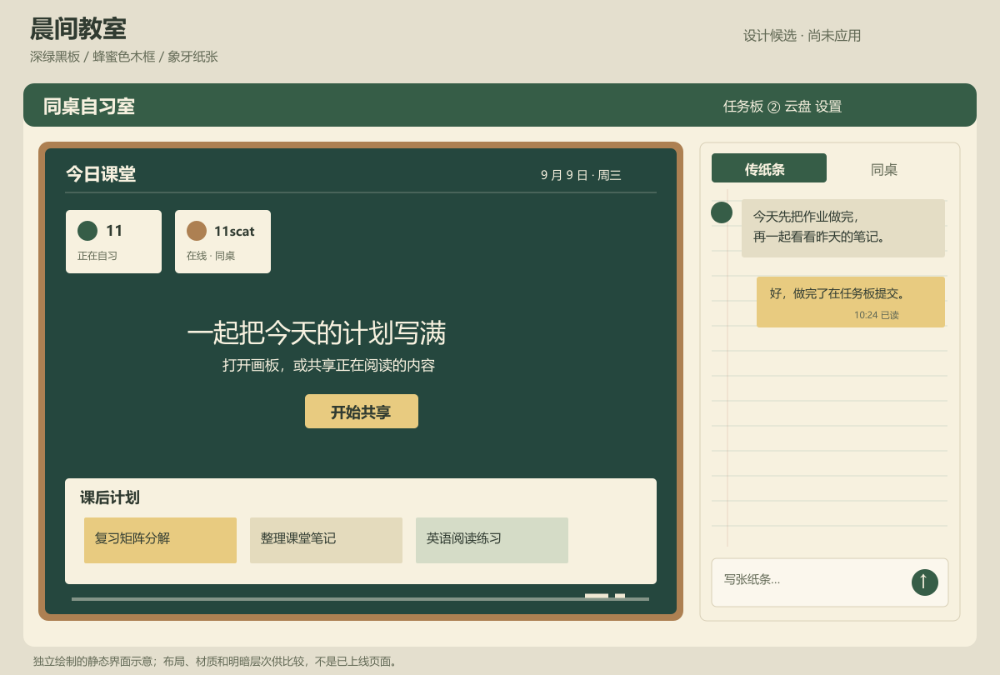
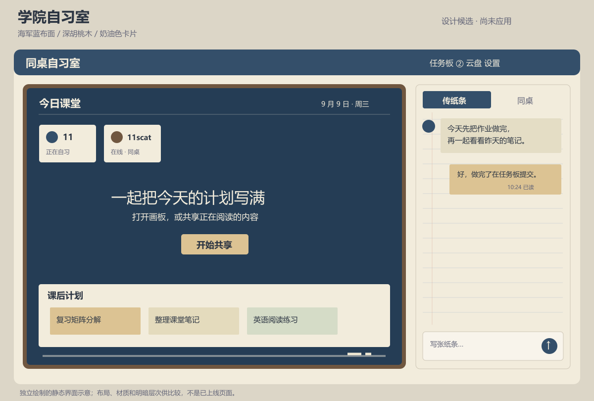

# 教室学院主题：设计候选与实施范围

日期：2026-09-09。后续用户已选择晨间教室方向并给出九处修改要求，最新方案见[外观细化与人物区域布局](classroom-theme-refinement-2026-09-09.md)。以下为最初两张候选的历史说明，尚未应用到网站。用户此前明确表示具体外观继续考虑，近白预设和后续较深配色均未采纳，因此不能把此前候选当成已确认设计。

## 方向与效果图

这次把教室中的物件关系转为界面形式：主显示区由深色板面与窄木框承接，共享按钮使用纸黄色；聊天区域采用笔记页的留白和淡线条，公共任务继续使用便签。长时间阅读的文字放在清晰、均匀的背景上，木框和纸张特征主要由边界、形状和少量明暗表达，避免强纹理穿过正文。

### 候选一：晨间教室

深绿色板面承载主要显示内容，象牙色纸面作为阅读区域，蜂蜜色窄边框表达普通教室的木质装饰。这个方向与现有黑板任务板的关系更直接，建议优先考虑。

### 候选二：学院自习室

海军蓝板面和深胡桃木边框更接近学院阅览室，仍保留纸张聊天区与黄色便签。它用于比较用户更偏好普通教室还是学院书房的氛围，页面信息层次与候选一一致。

两图均为独立绘制的静态设计示意，未使用第三方界面图片，不是上线截图。示意中的“课后计划”用于展示便签如何嵌入主显示区，具体是否保留这一布局仍待选择。

## 依据与颜色检查

[USWDS 色彩设计令牌](https://designsystem.digital.gov/design-tokens/color/overview/)强调颜色要按用途组织；实施时应把黑板、纸面、边框与交互强调分别定义，不能继续给所有组件套用同一浅色。未来若恢复自选颜色，应允许更换完整主题方案或受约束的交互强调色，避免只改少量按钮而与固定材质冲突。

[WCAG 2.2 最低对比度说明](https://www.w3.org/WAI/WCAG22/Understanding/contrast-minimum.html)要求普通文字至少 4.5:1，大字至少 3:1。本次使用标准相对亮度计算检查主要文字组合，结果如下；这只验证所列实色组合，不能替代实际浏览器中全部状态和组件的检查。

| 候选 | 正文 / 纸面 | 浅色文字 / 板面 | 按钮文字 / 强调色 |
| --- | --- | --- | --- |
| 晨间教室 | 10.36:1 | 9.08:1 | 6.61:1 |
| 学院自习室 | 10.51:1 | 9.49:1 | 7.20:1 |

公开来源于当日读取，图片、配色和界面安排为本项目设计建议，不是来源网站对本项目的要求。

## 待用户确认及原因

首先需要确定采用普通教室还是学院自习室的视觉方向，因为这会决定主显示区的大面积明暗和整站材质，直接改动容易再次落入用户已否定的配色方向。主画面是否保留示意中的课后便签区也需确认，它会改变共享画面可用面积。另需决定聊天笔记纸的装饰程度：示意保留淡横线，但较密集的长消息可能更适合纯纸色。

确认后应统一更新主窗口、任务板和聊天区域，再覆盖云盘、设置及流程弹窗的边界与选中状态。手机端不保留宽木框，用窄边与板面标题表达主题；不能为了装饰减少输入框和任务列表的可用空间。当前设置子菜单结构保持原实现，本轮不把未经选择的主题应用到用户正在使用的页面。
