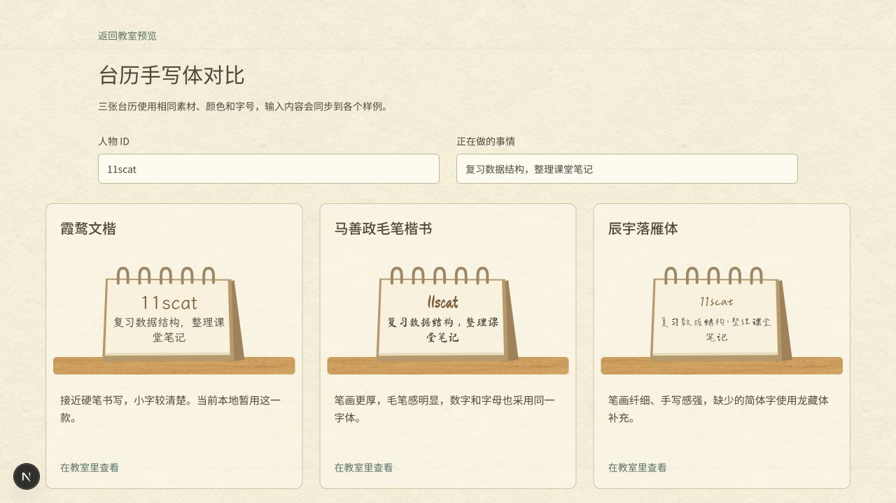
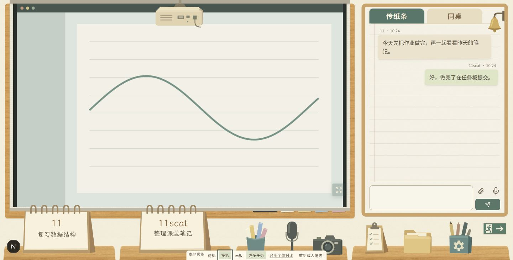

# 教室主题第三轮本地批注与台历字体候选

本轮继续在 `codex/classroom-local` 分支调试，未推送或部署。现有课桌、物品、墙面、黑板和纸张素材均沿用原文件；本轮调整布局、字体与交互，字体选择仍由用户比较后确定。

## 批注对应实现

| 批注 | 本地实现 |
| --- | --- |
| 1 | 待机黑板与画板的全屏入口采用手绘箭头和现有粉笔颗粒；投影状态保留原有图标与按钮底色。快捷键与输入框保护逻辑不变。 |
| 2、7 | 将聊天右移 38 像素和黑板右侧扩大 28 像素合并为容器布局。在 1441 像素宽度下，聊天区域比原来窄 38 像素，黑板增宽 28 像素，两者间距由 9 变为 19 像素，页面右侧边界不变。 |
| 3、4 | 两个页签共同向上移动 6 像素，通过减少页签行高度实现，避免分别设置位置后出现偏差。 |
| 5 | 页签行减少的 6 像素与聊天容器上移 4 像素合并，消息区域整体上移 10 像素，输入区仍位于面板下端。 |
| 6 | 沿用原铃铛的全部路径与颜色，将挂架和钟体分组，悬停与摇铃时只让钟体绕悬挂点转动，底座不动。 |
| 8、9、10 | 任务从文本区域顶部开始排列，采用统一行距。显示数量依据文字实际换行高度和区域高度计算，取消固定三条限制，避免显示被截断的下一条。较长标题仍最多显示三行。 |
| 11 | 投影仪整体向上移动 12 像素，保持素材比例和幕布前方的层级。 |
| 12 | 台历姓名、正在做的事情及其编辑输入均改为手写字体。本地暂用霞鹜文楷，另提供三款字体的相同内容对照及整页试用入口。 |
| 13、14 | 桌面下黑板高度减少 22 像素，底框、板擦与粉笔跟随黑板下沿一起上移，课桌位置不变。 |
| 15 | 幕布内不再显示公共任务的演示文字，真实页面继续显示投屏或摄像头。媒体容器上距幕布 10 像素，下距 11 像素，全屏按钮覆盖在媒体上；画面继续按比例容纳，保留必要的黑边。 |

宽屏的横向调整在 1166–1441 像素之间逐渐增加，在 1166 像素及以下保持原来的紧凑间距；721–1000 像素仍沿用既有双栏规则，720 像素及以下保留上下布局。黑板下沿上移仅应用于桌面双栏，手机较小的黑板保留原高度。未把单次批注中的负外边距逐项叠加到任务文字上。

## 台历手写体候选与授权

[打开字体对比页](http://127.0.0.1:3008/classroom-preview/fonts)，可以修改姓名与正在做的事情，三张样例会同步变化。每款字体也有在完整教室内查看的入口，只影响该次本地预览。

| 字体 | 显示特点 | 来源与授权 |
| --- | --- | --- |
| 霞鹜文楷 Regular v1.522 | 接近硬笔书写，小字号可读性较好，当前本地暂用。 | [官方发布](https://github.com/lxgw/LxgwWenKai/releases/tag/v1.522)，SIL OFL 1.1，网页子集采用新的内部名称 School Calendar Pen。 |
| 马善政毛笔楷书 | 笔画较厚，毛笔感明显，数字及字母也有较强的手写风格。 | [Google Fonts 源文件](https://github.com/google/fonts/tree/main/ofl/mashanzheng)，SIL OFL 1.1，网页子集采用新的内部名称 School Calendar Brush。 |
| 辰宇落雁体 2.0 Thin | 纤细、随手书写感较强，但简体覆盖不完整，缺字由龙藏体补充。 | [作者仓库](https://github.com/Chenyu-otf/chenyuluoyan_thin)，SIL OFL 1.1，沿用已制作的 Classroom Yan 网页文件。 |

这些授权允许按许可条件在网站中使用和嵌入，也允许商业使用；字体本身不能单独出售，分发时应保留版权与许可。新增两款保留字形轮廓，转换为网页格式并提供常用字子集，各自缺字由配置中的后续字体补充。原始许可和具体字符数量见[素材署名](../public/classroom/ATTRIBUTION.md)，没有上传字体或用户数据到第三方服务。

## 本地验证

生产构建、TypeScript 检查和教室相关五项测试通过，相关代码静态检查没有错误，首页保留既有四条警告。浏览器确认 1441×731 时黑板为 982.32×604.05，聊天面板为 411.68×599.05，两者顶部均为 10 像素；任务区域能完整放下六条当前字号的单行示例任务。

1166 像素宽度下仍保留 9 像素间距，黑板宽度仍为 766.84 像素；390 像素宽度没有横向溢出，台历示例文字没有超出内容区。铃铛悬停时检查了钟体的旋转和挂架保持固定，画板的全屏入口使用粉笔图案，投影时恢复普通图标。

预览投影使用离线生成的无文字图形演示流，不请求摄像头或屏幕权限，也不发往房间。它用于确认媒体比例、幕布边距和按钮覆盖位置；真实双人媒体与真机触控仍待本地验收。

