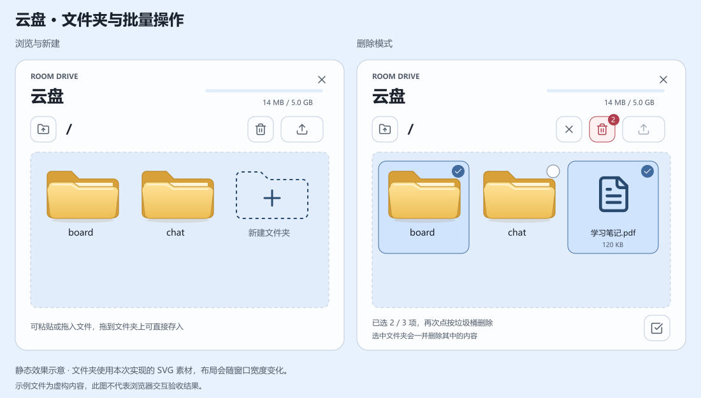

# 云盘布局与批量操作实施记录

日期：2026-09-08。已按用户截图中的 7 处标注完成代码实现，作为新增第 20 项处理，不再保留为待办。

## 界面与使用方式

上图为静态效果示意，复用本次实际编写的文件夹 SVG，示例文件为虚构内容。实际布局随视口宽度变化，图中效果不代表真实浏览器验收结果。

| 截图标注 | 实现结果 |
| --- | --- |
| 1：删除各项下方的删除按钮 | 文件和文件夹均不再显示单独删除按钮，普通状态保留文件查看与下载。 |
| 2：上一级改为图标 | 使用带向上箭头的文件夹图标，保留悬停说明和读屏名称，根目录禁用。 |
| 3：顶部改为删除模式 | 点击垃圾桶进入选择状态，点击当前目录内的文件或文件夹进行多选，再次点击垃圾桶删除所选。未选择时再次点击退出，旁边的关闭图标也可取消。 |
| 4：右下角出现全选 | 删除模式下显示全选图标，再次点击取消全选，按钮状态与已选数量同步。 |
| 5：列表中新建文件夹 | 虚线加号文件夹位于最后一个现有文件夹之后、文件列表之前；点击立即出现新文件夹的命名输入并选中默认名称，Enter 或失去焦点时保存，Esc 取消。创建失败保留输入供修改。 |
| 6：整体文件夹造型 | 自行绘制黄色文件袋 SVG，包含页签、浅色纸张及前袋的渐变与阴影，普通文件夹不再套白色方框。删除选中或拖放悬停时才显示边界提示。 |
| 7：增加上传方式 | 文件选择器支持多选，云盘内支持粘贴文件或截图；拖放到空白处上传到当前目录，拖放到可见子文件夹上传到该目录，并显示目标提示。 |

删除模式会明确显示所选数量，选择文件夹时会一并删除其中内容。第二次点击垃圾桶即执行，不再逐项弹出确认框；删除只覆盖当前可见列表中选中的路径，操作期间不能修改选择或切换目录。部分删除失败时移除成功项，保留失败项的选择与错误信息，避免把整批误报为成功。

新文件夹的默认名称会避开当前列表中的同名项目，服务端仍会检查名称冲突。上传按本次操作捕获的目标目录逐个处理，不会因后续界面变化而改变位置；剪贴板的 `files` 和 `items` 不重复读取同一批文件，某个文件失败后继续处理其他文件并汇总结果。普通文本粘贴仍用于命名输入，不会被当成文件；拖入整个本地文件夹暂不支持，会提示改为选择其中的文件。

## 相关修正

原目录读取和容量查询会自动创建 `chat/pics`，导致删除 `chat` 后刷新又出现。现在这两类读取仅确保云盘根目录存在，聊天专用目录在实际保存附件时按需创建，后续聊天附件的自动保存仍有效。

云盘界面集中到 `app/CloudDrive.tsx`，上传与批量删除逻辑位于 `app/cloud-drive-actions.ts`。图标使用现有 Lucide 和项目内 SVG，没有新增资源依赖；黄色文件袋按用户指定保留通常颜色，其余按钮与选中背景继续适配主题。

## 验证范围

生产构建通过，全部 25 项测试通过。新增测试检查剪贴板去重、拖放目标限制和中文路径编码，并覆盖多文件部分失败以及只删除所选路径；原有文件删除测试新增了删除聊天目录后读取列表不会重建它的验证。原有云盘源附件保护、语音保存和容量检查测试继续通过，修改文件 ESLint 无错误，保留 4 条既有图片优化提示。

浏览器工具此前的恢复操作被自动审批检查拒绝，本次未重试，因此真实浏览器中的拖放、系统剪贴板和布局尚未实测。测试使用模拟上传请求及临时目录，没有上传或删除真实云盘文件；示意图仅供判断设计效果。
