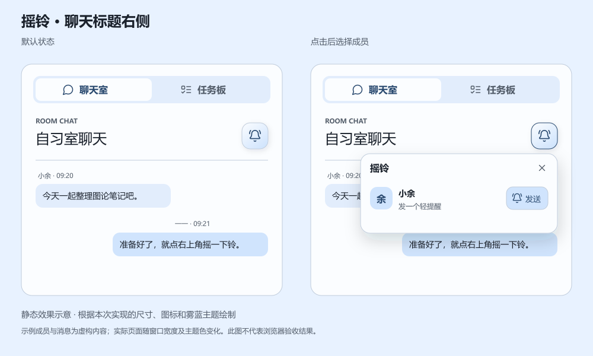

# 摇铃入口迁移与图标设计调研

日期：2026-09-08。对应用户新增的 0 级需求：将摇铃入口移到截图中“自习室聊天”标题右侧，标注点约为截图宽度 86.4%、高度 66.6%，并使图标与交互表现更符合摇铃含义。本文保留实施前调研，并补充用户确认实施后的代码结果与效果示意。

## 当前实现与迁移范围

已同步并核查远端 `main` 的提交 `5ab903bc45227ea46df7e34cb4701bba86b1103b`。当前 `app/page.tsx` 将 `RoomBell` 放在顶部 `topbar-actions` 中；`app/RoomBell.tsx` 同时负责入口、成员面板及收到提醒的通知卡，前台每 3 秒读取状态，后台每 15 秒读取，恢复可见或联网时再次读取。

远端已经实现发送、接收者确认、发起者取消、身份权限和持久记录。最新 `app/api/room/rings/store.ts` 为新会话设置 120 秒有效期，调度器约每 3 秒尝试一次推送，最多 40 次；这与较早的 `docs/room-bell-2026-09-07.md` 中“单次、不自动重发”的文字已有差异，本报告以当前代码为依据。服务端接受推送与手机实际提醒仍是不同状态，本次位置调整不扩大设备能力承诺。

入口本身只打开成员列表，不直接向所有人摇铃。建议继续保留这个操作方式，在列表中选择接收人并发送，避免把图标外观变化变成新的群体提醒行为。

## 推荐布局

采用聊天标题行右侧的独立图标按钮，与“自习室聊天”文字垂直居中，右边缘对齐聊天内容区。标题行使用 `grid-template-columns: minmax(0, 1fr) auto`，保留约 12px 间距，按钮不额外增加一整行；截图的百分比用于识别目标区域，不作为生产页面的绝对定位数值。

点击区域建议 44×44px，内部铃铛约 21–22px、线宽 1.8px，表面使用当前主题的浅强调背景、细边框和柔和阴影。紧凑圆角外框承载完整铃铛轮廓，铃舌和两侧声波保持清楚，不使用单个汉字或系统表情作为图标；默认显示图标，悬停提示“摇铃”，读屏名称为“打开摇铃面板”。这组尺寸为待视觉验证的起点。

## 图标与状态

Lucide 官方提供 `BellRing`，本地已安装的 lucide-react 0.468.0 也包含它及 ISC 许可声明，可以沿用当前图标体系而不增加资源依赖。[1]

| 状态 | 推荐表现 | 行为与准确文案 |
| --- | --- | --- |
| 默认 | `BellRing` 配浅主题背景，保留铃舌及两侧声波 | 点击打开成员面板，不直接发起提醒 |
| 面板展开 | 边框加深，保持铃铛形状 | `aria-expanded=true`，再次点击收起 |
| 自己发出的提醒仍有效 | 同一图标加小状态点，提示“有提醒正在进行” | 从服务器有效会话计算，不把打开面板当成正在摇铃 |
| 收到待确认提醒 | 数量角标及既有通知卡 | 保留“知道了”，切到任务板也应继续显示有效提醒 |
| 正在发送或取消 | 对应成员操作显示加载状态并暂时禁用 | 等待接口返回；请求失败不能提前显示已经结束 |
| 停止某个提醒 | 成员行使用 `CircleStop` 与“停止” | 沿用发起者取消接口；不使用容易被理解为静音的 `BellOff` |
| 连接异常 | 文案说明状态暂时无法确认 | 沿用现有重试与请求标识，不能用动画表示已成功送达 |

小幅摇动可以在悬停、键盘聚焦或发送成功后播放一次，建议 350–450ms，围绕铃铛上部摆动约 ±10°，随后静止。服务器仍在提醒时依靠状态点和文案表达，不让标题栏持续晃动；检测到 `prefers-reduced-motion: reduce` 时取消装饰动画。[3]

## 实施时必须处理的连接关系

1. **保留唯一且持续挂载的 `RoomBell`。** 目前聊天内容位于 `sideView === "chat"` 的条件分支中，直接把整个组件放进标题行，会在切到任务板时卸载轮询与页面通知卡。推荐让组件继续位于房间的持续渲染区域，只把触发按钮通过 Portal 渲染到聊天标题右侧的宿主节点；宿主节点消失时隐藏入口，状态控制器与接收通知卡继续运行。
2. **重新定位成员面板。** 当前 `room-bell.css` 使用 `position: fixed; top: 72px; right: 24px`，移动入口后继续使用会让面板出现在错误位置。应测量触发按钮的显示矩形，优先向下展开并右对齐，保留视口边缘约 12px；空间不足时向上展开，面板宽度不超过视口减去 24px，超长成员列表在面板内滚动。保留 Portal，以避免侧栏 `overflow: hidden` 裁切内容。
3. **适配滚动、焦点与通知链接。** 页面滚动、视口变化及手机键盘改变可视区域时重新计算面板位置；用户离开聊天标签时关闭成员面板，保留收到提醒的通知卡。通过 `/?ring=1` 打开网站时先切到聊天标签，再等待按钮宿主就绪并打开面板。触发按钮与面板分别保存引用，点击外部关闭时同时判断二者，不能继续假设 Portal 按钮是原容器的 DOM 后代。

触发按钮表示“展开面板”，应使用 `aria-expanded`、`aria-controls` 和适当的 `aria-haspopup`。建议将成员面板标注为非模态对话框，打开后将焦点放到合适的操作上，Escape 或关闭按钮恢复焦点至触发按钮；若入口已因标签切换消失，则恢复到聊天标签。WAI-ARIA 按钮模式明确区分展开动作与切换按钮，因此这里不把 `aria-pressed` 当作摇铃会话状态，也不改变现有 Enter、Space 的按钮操作方式。[2]

## 验证清单与本次结果

实施后需要检查预设和自由主题下的入口、数字角标及键盘焦点，覆盖桌面侧栏和 320–390px 手机视口；还要检查较长标题、成员面板靠近视口边缘、缩放及页面滚动。图片中的坐标不是屏幕或浏览器全局坐标，不能据此承诺最终像素位置。

功能验证应覆盖“打开面板不发送”“发送中不能重复点击”“切换任务板后仍收到通知卡”，并确认取消、确认及 120 秒过期后状态及时更新。定位与 Portal 调整需要浏览器验收，仅通过构建或接口测试不能证明面板没有被裁切；本轮未发送任何真实摇铃，也未执行浏览器交互或设备测试。

上述内容为实施前的验证计划，下节记录实际完成范围。已有摇铃服务继续按远端代码运行，本次没有修改摇铃频率、目标成员范围或手机和手表的提醒策略。

## 实施结果与效果示意

**处理状态：已完成代码实现。** 用户要求直接实施后，将入口放入“自习室聊天”标题右侧，采用 44×44px 按钮和 22px Lucide `BellRing`。按钮背景、边框与阴影使用当前主题变量，悬停或键盘聚焦时播放 420ms 摇动，减少动态效果设置会关闭动画。有效的发出提醒显示状态点，收到待确认提醒显示数量角标。

此图依据本次实现的尺寸、图标和雾蓝主题绘制，是静态效果示意，并非运行页面截图。成员与消息为虚构示例，实际页面会随视口和用户选择的主题色变化；后续涉及界面方案的调研应同时提供视觉预览，并说明预览性质。

`RoomBell` 持续挂载在聊天与任务板条件分支之外，只有入口通过 Portal 移入标题；切换任务板时隐藏入口并关闭面板，轮询与收到提醒的通知卡保留。面板根据入口矩形定位，监听滚动、尺寸及可视视口变化，空间不足时向上展开，长列表内部滚动。通知链接 `/?ring=1` 会先显示聊天标签，再打开成员面板；Escape 和关闭按钮将焦点返回入口。打开面板只显示成员，发送、停止及确认仍沿用已有接口。

验证结果：生产构建通过，全部 20 项测试通过，涵盖新增定位计算及原有摇铃 HTTP 生命周期、权限、并发去重、取消、过期和周期提醒逻辑。定位计算覆盖桌面、320px 窄屏以及带偏移的缩放视口，检查边界限制与向上展开。修改文件 ESLint 无错误，保留 `page.tsx` 已有的 4 条图片优化提示。

验证限制：浏览器工具最初无法初始化，恢复尝试随后被自动审批检查拒绝，返回信息没有说明具体原因，因此未继续浏览器交互验收。测试与代码检查不能证明浏览器中的视觉、焦点及跨标签表现已实测通过；本次也没有向真实成员发送摇铃。跨品牌手机及手表的持续震动仍按剩余需求第 12 项另行验收。

## 实际读取的公开来源

- [Lucide：Bell Ring](https://lucide.dev/icons/bell-ring)，并核对本地 `node_modules/lucide-react/dist/esm/icons/bell-ring.js` 与包内 LICENSE。[1]
- [WAI-ARIA APG：Button Pattern](https://www.w3.org/WAI/ARIA/apg/patterns/button/)，核对按钮键盘操作、展开与切换语义，以及焦点行为。[2]
- [MDN：prefers-reduced-motion](https://developer.mozilla.org/en-US/docs/Web/CSS/@media/prefers-reduced-motion)，核对减少非必要动画的用户偏好。[3]

上述网页读取时间为 2026-09-08，临时资料位于本地 `codex-generated`。现有主题色角色和对比度策略继续参考[主题配色报告](theme-color-research-2026-09-07.md)。
