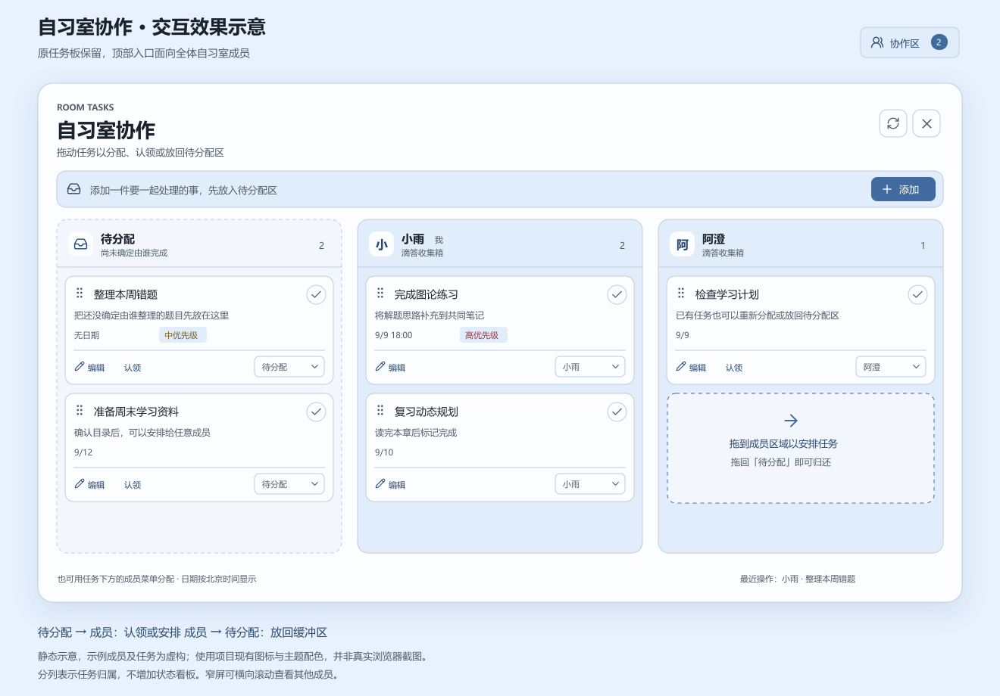

# 自习室协作区实施记录

日期：2026-09-08。本次作为新增第 21 项处理，已完成代码实现。现有任务板栏目保留，各成员旁边的“添加待办”入口移除，顶部新增面向全室的“协作区”。

## 界面与操作

上图使用项目现有图标及雾蓝主题配色绘制，成员和任务均为虚构示例，属于静态效果示意。它展示本次布局与操作方向，不代表真实浏览器截图或交互验收结果；图中的虚线说明框用于解释拖放，实际界面通过整个目标区域高亮提示落点。

协作弹窗同时展示待分配区与全部已登记自习室成员的收集箱，包括当前离线成员。分列只表示任务归属，不引入按状态划分的看板，也不调用滴答官方共享清单协作。未连接滴答的成员仍可使用公共待分配区，其成员列会提示连接状态，在接入前不能接收分配到个人收集箱的任务。

| 操作 | 实现行为 |
| --- | --- |
| 新建任务 | 在弹窗顶部填写标题，先加入全室共享的待分配区。 |
| 认领 | 点击任务下方的“认领”，或拖至自己的收集箱列。 |
| 给他人安排 | 拖至目标成员列，或使用任务下方的成员菜单选择接收人。 |
| 重新分配 | 已认领任务可以转给其他已连接成员。 |
| 放回缓冲区 | 拖回“待分配”列，或在成员菜单中选“待分配”。 |
| 编辑 | 点击标题或编辑入口，调整标题、说明、优先级及日期；标签、提醒和常用重复规则也可修改。 |
| 完成与删除 | 卡片右上角标记完成；编辑界面内连续两次点击删除按钮删除该任务。缓冲区任务完成后从当前列表移除，不建立单独的完成历史栏目。 |

拖动通过卡片左侧的握柄开始，支持鼠标和触屏指针；拖动时显示任务浮层，目标区域高亮，并支持边缘滚动。成员较多或窗口较窄时，可以横向滚动查看其他收集箱。成员菜单与认领按钮提供无需拖动的操作方式，弹窗使用原生 `dialog`，包含关闭、Esc 及编辑表单的键盘焦点约束，弹窗中的按键不会触发主窗口 F 全屏。

日期在编辑界面按北京时间显示，未修改日期时保留原始时间值及任务时区。现有自定义重复规则和多条提醒可原样保留，预设支持每天、每周或每月，以及到时、提前 15 分钟或提前 1 小时提醒。已有检查项与描述随任务字段保留，本次没有增加检查项编辑界面。

配色引用现有主题变量，公共区和成员区随主题变化；高、中优先级保留用于辨识含义的提示色。主页面原有任务板仍按既有日期筛选显示，协作区则读取各成员整个未完成收集箱，因此两处任务数量可能不同。

## 账户权限与保存方式

该站点当前只有一个自习室，全部已登记身份属于同一协作范围。每位登录成员都能查看并操作已连接成员的收集箱任务，服务端按照任务归属解密对应成员的授权，不将授权内容返回浏览器。写操作同时检查登录身份、请求来源、任务版本及所属收集箱，任意客户端传入的清单编号不会用于跨用户写入。

待分配任务保存在服务器数据目录的 `room-collaboration.json`，不归属于某个滴答账户，也不会因为发起人退出浏览器而消失。文件内同时保存分配进度及操作编号，通过同进程队列串行修改和临时文件原子替换保持记录一致。当前部署为单个 Node 服务进程；未来若改为多个实例同时写入，须先把这些记录迁移到支持事务和共享锁的存储，不能让多个进程直接共用此 JSON 文件。

滴答官方任务移动接口不能完成跨账户转移，因此分配流程会在接收账户建立任务并读取核对，确认后才移除来源任务。每次转移预先保存固定的接收方任务编号，响应丢失后先查询该编号再继续，避免直接重建副本。任务转回缓冲区时，服务器先保存受锁定的临时条目，待个人收集箱中的来源任务移除后才解除锁定。

两人同时认领同一任务时，服务端只接受当前版本对应的一次转移；处理中任务不能接受另一项修改。请求中断后，弹窗显示“继续”和“取消转移”；来源已经移除时只能继续完成，来源仍存在且接收副本未被改变时才允许撤回副本。若接收副本也发生变化，会停止自动撤回并提示核对，避免删除成员新写入的内容。对于修改、完成或删除请求，“停止重试”只结束尚未确认的重试，不承诺撤销滴答已经执行的部分操作。

## API 依据与当前边界

依据为 2026-09-08 查阅的[滴答 Open API 文档](https://developer.dida365.com/docs#/openapi)及其[Markdown 文档](https://developer.dida365.com/docs/openapi.md)。本次使用账户范围内的任务读取、更新、完成及删除，并通过 `POST /open/v1/task/batch` 携带固定任务 ID 创建接收副本；评论查询用于判断能否转移原记录。

任务板与协作区共用官方 `GET /open/v1/project/inbox/data` 读取函数。该接口可以省略 `project` 对象：有具体 `project.id` 时按其校验，没有时仅在返回的全部任务均有有效且一致的 `projectId` 后采用这个编号。`inbox` 由当前请求的 Bearer 授权确定所属账户，不依赖 V2 账户快照或全局收集箱配置；后续更新、删除和分配仍使用已识别的真实编号核对归属，多种任务编号混杂时不会任取第一项。

空收集箱优先复用当前授权已验证的编号，或补查官方清单元数据；两者都不可用时仍显示空列表，不报任务数据损坏。此时尚无具体编号可供写入，会在建立转移记录之前拒绝分配，提示先在该账户收集箱添加一项后刷新。编号缓存按授权隔离、最多保留 100 项，仅存于服务进程内；重启后需要重新发现编号，不将只读 `inbox` 别名用于跨账户任务写入。

存在父子任务关系、可识别的附件或评论时，本次暂不跨账户转移；接口返回的专注历史也会阻止转移，以保留已有记录，不因此新增专注管理功能。检查项、标签及重复规则等文档公开字段会保留并核对，但新账户里的任务仍然是新 ID，原链接、创建历史及 API 未暴露的元数据不能保证迁移。没有新增习惯、倒数日或状态看板功能。

服务端会在删除来源前再次核对任务版本，但外部 API 未提供本次已确认可用的原子条件更新保证。若有人恰好在滴答 App 中于最终核对与写入之间修改同一任务，仍有竞争窗口；自动化测试覆盖本服务的并发及可观测版本冲突，不能证明外部系统提供原子跨账户事务。

协作弹窗可见时约每 15 秒重新读取收集箱，页面约每 5 秒检查本地协作记录版本；本网站发生协作操作后会刷新自己的主任务板。离线或授权失效时显示错误，不提前把任务从界面移除。现有“收到的新待办”历史提示保留用于旧记录，本次新增协作操作通过协作区及任务刷新呈现，不生成旧接口的未读提示记录。

## 验证范围

本次已通过生产构建、TypeScript 检查及全量 31 项自动化测试。新增 6 项协作测试使用独立临时数据与模拟滴答接口，覆盖 HTTP 身份与来源检查、跨成员缓冲区可见性、过期版本拒绝，以及多人认领和转移失败恢复；提供方适配测试还验证授权账户与收集箱匹配、固定 ID 重试和已有检查项等字段保留。没有为测试修改任何真实滴答账户。

针对本次文件的 ESLint 无错误，主页面仍有 3 处已有的图片优化提示。效果图已经逐图检查，但真实浏览器拖放、窄屏触控、双设备同步以及真实滴答重复任务行为仍未验收；自动审批拒绝了此前的浏览器恢复操作，未返回具体原因，本次没有尝试替代浏览器控制路径。

代码通过现有 GitHub 容器构建与 VPS 部署流程发布，部署结果以对应提交的流水线记录为准。生产登录页的只读可用性检查不能替代登录后的协作操作验收。

## 收集箱接入修正

用户反馈已连接滴答、主任务板可用，但协作区提示“暂时无法识别该成员的收集箱”。代码核查发现，初版协作区将旧 V2 快照返回 `inboxId` 设为必要条件，而连接验证和主任务板的普通清单读取使用官方 Open API；有效的 Open API 授权并不保证旧 V2 快照可用，因此初版的“重新连接”提示不足以说明真实原因。此前适配测试模拟了 V2 正常返回，遗漏了这一兼容性情况。

2026-09-08 重新查阅官方文档的 Get Project With Data 参数后，改为直接使用其明确支持的 `inbox` 标识。任务板、协作区及保留的旧新增接口已统一调用 `tickInboxData`，应用代码不再调用 V2 快照，也不再使用 `TICKTICK_INBOX_ID` 回退。主任务板在收集箱暂时失败时仍展示成功读取的普通清单，并单独说明收集箱错误；临时网络异常、限流与返回数据不完整不会被误报成需要重新授权。

本次回归覆盖旧 V2 拒绝访问但 Open API 可用、空收集箱，以及两位成员请求归属。新增测试还验证任务板合并普通清单与收集箱结果，并区分暂时故障和授权失效。全量构建及 33 项自动化测试通过，真实账户授权信息未用于本地测试；最终连接效果仍需以登录后的实际接口响应为准。

后续用户仍遇到“滴答收集箱返回的数据不完整”。当前校验要求 `project.id` 为真实编号，尚需确认实际响应是否省略该字段或返回别名，前述模拟测试不能证明真实账户格式兼容。为取得现场依据，新增仅登录后可用的 `/api/ticktick/diagnostics`：用当前成员原有授权只读查询收集箱数据及清单元数据，返回已知字段的类型、任务数量和编号种类，不返回令牌、真实编号或任务正文。诊断功能通过构建及 34 项测试，解析修复仍等待实际诊断结果。

用户反馈诊断链接进入了普通主页。核查发现登录页没有传递中间件提供的 `next` 地址，登录成功始终跳到 `/`；现已修正目标路径的传递与登录失败重试，同时限制为本站路径，阻止外部跳转与登录循环。另在滴答连接设置及协作区错误下方增加“查看连接诊断”按钮，在原页面展示并复制结果；协作区格式错误直接携带同一次失败响应的脱敏结构，可核对出错成员，无需另开诊断链接。此轮构建及 36 项自动化测试通过，涵盖真实 Next 登录重定向链和诊断归属传递。收集箱解析故障仍等待现场结果后修正，不能将诊断入口可用等同于任务同步已恢复。

### 实际响应确认与修复

用户提供的现场诊断为 HTTP 200，根对象包含 `tasks` 数组与 `columns` 数组，但没有 `project`、顶层 `id` 或 `projectId`。24 条任务全部具有具体的 `projectId`，不同编号数量为 1，缺失编号数量为 0。该证据确认了有效任务数据被旧的 `project.id` 必填检查误拒绝，已按上述实际格式修正读取函数。

新增对应形状的 24 条虚构任务用例，验证全部条目及原字段保留；任务板路由与协作提供方测试同样改用无 `project` 的响应，并验证空列表和无法解析编号时不会发生任务写入。此轮构建及全量 39 项测试通过，没有使用真实令牌或修改用户任务；线上实际同步恢复仍以刷新后的账户响应为准。
