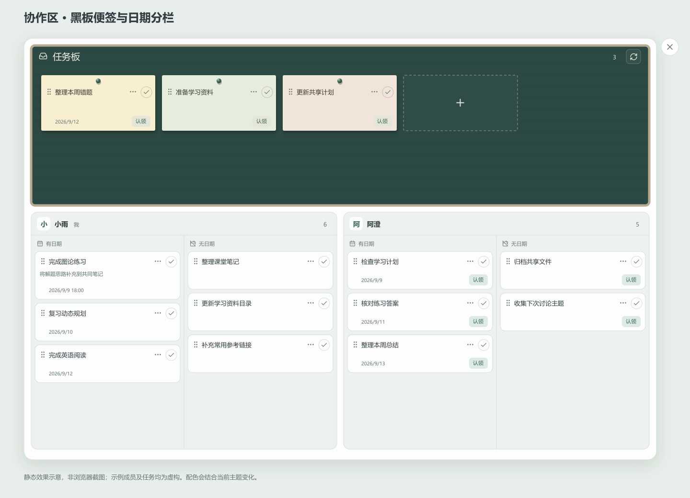
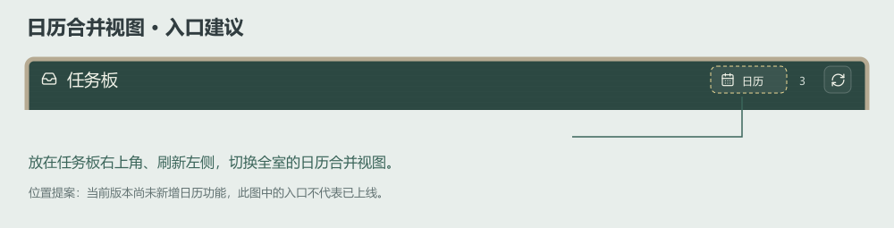

# 自习室协作区实施记录

> 2026-09-08 最新规则：跨账户任务转移已由保留原任务的认领审批流程替代，以下旧转移说明只作为历史记录。请以[认领审批实施记录](claim-approval-workflow-2026-09-08.md)为准。滴答 App 手动勾选联动按用户要求暂缓。

日期：2026-09-08。本次作为新增第 21 项处理，已完成代码实现。现有任务板栏目保留，各成员旁边的“添加待办”入口移除，顶部新增面向全室的“协作区”。

## 界面与操作

上图使用项目现有图标及青绿主题方向绘制，成员和任务均为虚构示例，属于静态效果示意。它展示本次黑板便签样式与成员内部日期分栏，不代表真实浏览器截图或交互验收结果；实际拖放通过整个目标区域高亮提示落点。

协作弹窗上方是横跨整行的公共待分配区，名称为“任务板”，向上使用原标题栏的空间，并扩大到约占内容区高度的四成。公共区采用带低饱和度边框的深色黑板，任务卡使用纸色便签、图钉与轻微投影；刷新按钮位于黑板右上角。去掉“自习室协作”可见标题，关闭按钮统一位于面板右上方外部，并留出视口边距；关闭按钮仍属于原生弹窗的键盘焦点范围。

下方两位成员的收集箱左右均分，每位成员内部再分为左右两栏：左侧有日期任务按截止时间从早到晚排序，没有有效截止时间时采用开始时间，右侧无日期任务保留返回顺序。相同时间的任务保留原顺序，日期显示年份以区分跨年任务；分栏和排序只改变显示，不修改滴答数据。两栏分别滚动，拖动用于改变任务归属，进入目标成员后由已有日期自动决定所属栏。

全部已登记成员都会显示，包括当前离线成员；超过两人时以两列继续排列，窄屏保留成员区和内部两栏的可读宽度并允许横向滚动。分列只表示任务归属与日期类别，不调用滴答官方共享清单协作。未连接滴答的成员仍可使用公共任务板，其成员列会提示连接状态，在接入前不能接收分配到个人收集箱的任务。

| 操作 | 实现行为 |
| --- | --- |
| 新建任务 | 点击公共任务板末尾的虚线加号卡片，自动进入标题输入；Enter 保存，Esc 或空白标题取消。输入后离开输入框也会保存。 |
| 认领 | 点击卡片日期旁的“认领”，或拖至自己的收集箱列。 |
| 给他人安排 | 拖至目标成员区域，移除原成员分配菜单。 |
| 重新分配 | 已认领任务可以转给其他已连接成员。 |
| 放回缓冲区 | 拖回上方公共“任务板”。 |
| 编辑 | 点击标题直接输入，Enter 保存、Esc 取消，不再占用独立的编辑操作行；右侧省略号打开详情，继续支持说明、优先级与日期等设置。 |
| 完成与删除 | 卡片右上角标记完成；编辑界面内连续两次点击删除按钮删除该任务。缓冲区任务完成后从当前列表移除，不建立单独的完成历史栏目。 |

拖动通过卡片左侧的握柄开始，使用鼠标和触屏指针事件；拖动时显示任务浮层，目标区域高亮，并支持列表边缘滚动。键盘聚焦握柄后按空格或 Enter 提起，方向键选择归属，Enter 放下、Esc 取消，移开焦点也会取消。认领按钮继续提供直接操作，弹窗使用原生 `dialog`，包含关闭、Esc 及编辑表单的键盘焦点约束，弹窗中的按键不会触发主窗口 F 全屏。

标题输入在中文输入法选字期间不提交，并通过保存标记避免 Enter 与失焦重复发起同一次保存；失败时保留输入。改名只提交标题及开始编辑时的版本，不覆盖日期或其他字段。新增任务用固定操作编号处理重试，等待确认期间不能继续修改这份草稿，完成核对后关闭草稿。

可见标题与此前的 `ROOM TASKS`、标题下的操作说明、成员收集箱副标题及常驻底部操作记录均已去掉。“有日期”和“无日期”只作为成员内部栏标题，卡片不重复显示无日期说明；保存结果短暂显示，错误及未完成操作的恢复入口继续保留。

| 用户本轮要求 | 对应结果 |
| --- | --- |
| 去掉顶部标题 | 移除可见标题，通过弹窗无障碍名称保留识别信息。 |
| 刷新移入任务板 | 刷新图标位于黑板右上角，继续刷新全室任务。 |
| 关闭移到弹窗外部 | 位于面板右上方，预留视口边距并保留 Esc 关闭。 |
| 扩大任务板并采用便签风格 | 使用原标题空间，公共区约占四成，增加纸色便签、图钉、阴影和黑板边框。 |
| 每位成员内部按日期分两栏 | 左栏按有效任务时间排序，右栏显示无日期任务，各自滚动。 |

日期在编辑界面按北京时间显示，未修改日期时保留原始时间值及任务时区。现有自定义重复规则和多条提醒可原样保留，预设支持每天、每周或每月，以及到时、提前 15 分钟或提前 1 小时提醒。已有检查项与描述随任务字段保留，本次没有增加检查项编辑界面。

配色引用现有主题变量，黑板色调和纸色混入当前主题，图钉及个人任务区沿用主题配色；纸张与边框保留低饱和度材质色，高、中优先级保留用于辨识含义的提示色。主页面原有任务板仍按既有日期筛选显示，协作区则读取各成员整个未完成收集箱，因此两处任务数量可能不同。

## 日历合并视图入口方案

建议将“日历”图标加文字放在任务板右上角、刷新左侧，作为全室视图切换入口。该位置属于公共任务板，容易表达全体成员的日程范围；个人成员栏里的日期图标仅用于区分有日期待办，避免同时承担全室视图入口的职责。

点击后建议在当前弹窗切换为合并日历，使用“任务板”按钮切回，并保留各视图的滚动位置。日历中的任务显示成员标识，公共区有日期任务标为待分配；无日期任务保留在独立列表，避免在日期网格中随意指定时间。首次可用周视图呈现近期安排，再提供月视图查看较远日期。

代码核查确认，当前主页面具有今天、本周、无日期筛选，尚无独立的合并日历组件。本轮完成入口位置建议和静态示意，未添加无功能的日历按钮；日历切换及日期网格仍待后续实现，此项未计入本轮已完成界面功能。

## 待处理操作挤占界面的问题

用户后续截图显示多条“接收方任务尚未核实”的转移记录横占弹窗顶部，黑板被向下推，待处理便签也明显发灰。代码确认，恢复操作列表此前直接参与主布局，整张待处理卡片又叠加透明度；上一版示意只画了正常状态，没有覆盖转移积压，不能证明异常情况下的显示效果符合预期。

本次将恢复列表移入独立的原生弹窗，仅在黑板右上角显示“待处理”及数量。点击该入口或便签内的“查看待处理操作”打开恢复面板，错误消息以可收起的浮层提示，不再改变任务板高度。待处理卡片保留原纸色和标题清晰度，受限制的操作按钮仍禁用。外侧关闭按钮统一放到面板右上方，避免从面板右侧伸出后接近屏幕边缘。

“接收方任务尚未核实”原先同时涵盖未读取到副本、状态变化与字段不一致，截图无法区分这三种情况。服务端现在返回具体核验类别及不一致字段的名称，保持原有字段一致性检查；恢复面板增加“查看核对结果”，通过已登录身份只读核对来源和接收副本，不返回任务正文、真实编号或授权信息，不执行继续或取消转移，也不修改恢复记录。

本轮没有取得这些真实账户副本的核对结果，因此不能声称转移故障已经修复。已有未完成操作继续保留，用户可以先查看核对结果，再决定后续处理；本地测试只验证诊断分类、权限检查以及核对不产生写入。当前玫瑰主题中的黑板会呈现灰紫色，前面的青绿静态示意不代表所有主题下的最终颜色。

## 账户权限与保存方式

### 转移来源调查：已确认部分记录由另一账号发起

用户随后明确表示没有发生这些拖动，并怀疑相关任务本来就在另一位成员的收集箱。此前将积压归因于用户拖动、建议直接接续旧记录，缺少发起证据，予以撤回。任务方向只能说明记录中的来源和目标，不能说明发起人，也不能证明转移符合用户意图；查明前不执行旧记录接续或清理任务。

已核查当前账号授权存储、收集箱提供方、协作读写路由及最初提交 `1232b7e`：读取授权按网站身份索引，读取列表不会创建操作记录；新记录由已登录账号的写请求产生，发起账号保存在 `actorId`。拖放、认领和初版成员下拉菜单均可提交转移。初版也检查来源和目标是否为同一个收集箱，但代码检查无法证明现场曾保存的授权绑定正确。

界面现在显示记录已有的“发起账号”，并将 `updatedAt` 明确标为“最近处理”。新记录另存不可随重试改变的首次时间，旧记录显示“首次时间未记录”，不把最后重试时间回填成产生时间。新增测试覆盖反复读取不会创建转移、另一成员发起时账号与来源不同、重试不更换发起账号或首次时间；测试使用独立的虚构账户，不能代替线上归属核验。此修改用于取得现场证据，不代表记录来源已经查明或故障已经解决。

用户随后明确自己的账号为 `11`。其新截图 `codex-clipboard-7d338692-db3a-4c1f-9026-ef5ba189f9cf.png` 中，可见的 5 条记录均显示发起账号为 `11scat`，其中 4 条方向为 `11 → 11scat`，test 为 `任务板 → 11scat`。这确认了这些可见请求由另一网站账号提交，不能继续归因于用户账号 `11`；局部截图不能证明其余 4 条记录的发起账号。请求方向符合点击“认领”的行为，但旧记录未保存入口，无法区分点击、拖动或初版菜单操作。

对照用户 10:45 发来的旧截图，专业英语 assignment1～5 当时已显示在 `11 我` 栏，尚未出现待处理列表；11:04 的截图中才见到失败记录。这是界面显示历史，不能证明接收账户没有早已存在的同名任务。当前尚待明确任务最终应留在哪个账号，并核对接收方副本是否来自这些请求；未执行真实任务的接续、取消或删除。发起账号显示修正 `c13268d` 已成功部署，相关检查及 53 项测试通过，不能将该验证结果记为积压已经清理。

### 2026-09-08 创建编号与重复重试修复

重新连接浏览器后，实际协作区显示 9 条待处理记录，接收账户中已出现对应任务及部分重复标题。对其中一条记录的只读核对确认原任务未变化，但预存的接收任务编号查不到副本。代码将批量创建响应中的 `id2etag` 丢弃，始终查询客户端预设编号；此前模拟接口原样接受该编号，未覆盖服务端重新分配编号的情况。

现改为读取批量创建响应中的实际编号，在校验副本前持久化，并在后续核对、任务锁定和移除来源时沿用。创建前保存接收账户已有任务编号及请求已发出的状态，响应中断后不再重复发送创建请求；仅有一个新出现且全部受支持字段一致的任务时可以继续恢复，无法明确对应时保留来源。

旧记录没有请求前的快照，不能假设其预存编号有效。只读核对会列出接收账户中全部字段一致、未完成且未被其他操作占用的候选；“接续已有副本”会再次核对选中任务版本及来源版本，然后完成原来的转移，不再创建任务。其他同名任务和多余候选不会被自动删除。候选编号仅供已有成员调用恢复操作，不暴露授权或任务正文。

新增回归覆盖服务端重新分配编号、收到编号后验证连接中断、响应丢失后从新任务恢复、未知结果禁止重建，以及旧记录明确选择副本、过期版本及外部成员拒绝。本轮先通过 46 项测试；合入远端屏幕共享恢复更新后，最终本地生产构建及全部 51 项测试通过，相关 ESLint 和 TypeScript 检查通过。本地仍使用已缓存字体完成 Webpack 构建，线上原有 Turbopack 构建保持不变。修复提交 `55f64f469c74a20d30fbc246a04df1e1860329e0` 已经由 [GitHub 部署流程](https://github.com/yuumiqwq/duo-space/actions/runs/34184847697) 成功发布。

线上浏览器在本轮前半程可用，实际读到了任务列表及一条失败诊断，未发出继续、取消或删除任务操作。发布后读取恢复面板时，自动审批返回 `Strict automated review failed. Do not proceed or ask the user for approval.`，未说明具体原因，按要求停止浏览器操作。尚未直接取得滴答创建响应以确认现场的实际编号，也未接续上述 9 条积压，不能把已确认的响应处理缺陷与模拟复现写成线上恢复成功；既有重复标题任务仍未自动清理。

该站点当前只有一个自习室，全部已登记身份属于同一协作范围。每位登录成员都能查看并操作已连接成员的收集箱任务，服务端按照任务归属解密对应成员的授权，不将授权内容返回浏览器。写操作同时检查登录身份、请求来源、任务版本及所属收集箱，任意客户端传入的清单编号不会用于跨用户写入。

待分配任务保存在服务器数据目录的 `room-collaboration.json`，不归属于某个滴答账户，也不会因为发起人退出浏览器而消失。文件内同时保存分配进度及操作编号，通过同进程队列串行修改和临时文件原子替换保持记录一致。当前部署为单个 Node 服务进程；未来若改为多个实例同时写入，须先把这些记录迁移到支持事务和共享锁的存储，不能让多个进程直接共用此 JSON 文件。

滴答官方任务移动接口不能完成跨账户转移，因此分配流程会在接收账户建立任务并读取核对，确认后才移除来源任务。每次转移在请求前保存接收方已有任务编号，收到创建响应后先保存滴答实际返回的任务编号，再读取核对；无法确认请求结果时停止重复创建，结合已有副本继续处理。任务转回缓冲区时，服务器先保存受锁定的临时条目，待个人收集箱中的来源任务移除后才解除锁定。

两人同时认领同一任务时，服务端只接受当前版本对应的一次转移；处理中任务不能接受另一项修改。请求中断后，弹窗显示“继续”和“取消转移”；来源已经移除时只能继续完成，来源仍存在且接收副本未被改变时才允许撤回副本。若接收副本也发生变化，会停止自动撤回并提示核对，避免删除成员新写入的内容。对于修改、完成或删除请求，“停止重试”只结束尚未确认的重试，不承诺撤销滴答已经执行的部分操作。

## API 依据与当前边界

依据为 2026-09-08 查阅的[滴答 Open API 文档](https://developer.dida365.com/docs#/openapi)及其[Markdown 文档](https://developer.dida365.com/docs/openapi.md)。本次使用账户范围内的任务读取、更新、完成及删除，并通过 `POST /open/v1/task/batch` 创建接收副本，以响应 `id2etag` 中的实际编号进行核对；评论查询用于判断能否转移原记录。

任务板与协作区共用官方 `GET /open/v1/project/inbox/data` 读取函数。该接口可以省略 `project` 对象：有具体 `project.id` 时按其校验，没有时仅在返回的全部任务均有有效且一致的 `projectId` 后采用这个编号。`inbox` 由当前请求的 Bearer 授权确定所属账户，不依赖 V2 账户快照或全局收集箱配置；后续更新、删除和分配仍使用已识别的真实编号核对归属，多种任务编号混杂时不会任取第一项。

空收集箱优先复用当前授权已验证的编号，或补查官方清单元数据；两者都不可用时仍显示空列表，不报任务数据损坏。此时尚无具体编号可供写入，会在建立转移记录之前拒绝分配，提示先在该账户收集箱添加一项后刷新。编号缓存按授权隔离、最多保留 100 项，仅存于服务进程内；重启后需要重新发现编号，不将只读 `inbox` 别名用于跨账户任务写入。

存在父子任务关系、可识别的附件或评论时，本次暂不跨账户转移；接口返回的专注历史也会阻止转移，以保留已有记录，不因此新增专注管理功能。检查项、标签及重复规则等文档公开字段会保留并核对，但新账户里的任务仍然是新 ID，原链接、创建历史及 API 未暴露的元数据不能保证迁移。没有新增习惯、倒数日或状态看板功能。

服务端会在删除来源前再次核对任务版本，但外部 API 未提供本次已确认可用的原子条件更新保证。若有人恰好在滴答 App 中于最终核对与写入之间修改同一任务，仍有竞争窗口；自动化测试覆盖本服务的并发及可观测版本冲突，不能证明外部系统提供原子跨账户事务。

协作弹窗可见时约每 15 秒重新读取收集箱，页面约每 5 秒检查本地协作记录版本；本网站发生协作操作后会刷新自己的主任务板。离线或授权失效时显示错误，不提前把任务从界面移除。现有“收到的新待办”历史提示保留用于旧记录，本次新增协作操作通过协作区及任务刷新呈现，不生成旧接口的未读提示记录。

## 验证范围

初版通过生产构建、TypeScript 检查及当时的 31 项自动化测试；黑板便签与日期分栏调整通过当时全量 41 项测试。待处理界面修正继续执行生产构建、TypeScript 和相关组件 ESLint，并增加只读转移核对的两项测试及 HTTP 权限检查，当前共 43 项测试。日期视图测试验证跨年顺序、截止时间优先及开始时间回退，覆盖时区换算、同时间稳定顺序和无日期任务完整保留。协作测试使用独立临时数据与模拟滴答接口，覆盖 HTTP 身份与来源检查、跨成员缓冲区可见性、过期版本拒绝，以及多人认领和转移失败恢复；提供方适配测试还验证授权账户与收集箱匹配、固定 ID 重试和已有检查项等字段保留。没有为测试修改任何真实滴答账户，这些测试不能代替新增输入框的浏览器事件验收。

另检查了四种预设和六种代表性自定义颜色下的三种便签纸色，共 30 组对比度样本；便签辅助文字加深后，最低对比度为 5.08:1，超过小号普通文字 4.5:1 的目标。此项是配色数值检查，不能替代真实显示设备上的观看效果。

待处理面板这一轮的本地默认构建遇到 Google 字体连接失败，随后用已缓存的相同字体文件，通过临时字体响应配置完成 Webpack 生产构建及全量 43 项测试。该配置和缓存只位于忽略提交的 `codex-generated` 中，线上继续使用原有 Turbopack 构建与字体配置，未修改网站字体来源。

针对本次文件的 ESLint 无错误，主页面仍有 3 处已有的图片优化提示。效果图已经逐图检查，但真实浏览器拖放、窄屏触控、双设备同步以及真实滴答重复任务行为仍未验收；自动审批拒绝了此前的浏览器恢复操作，未返回具体原因，本次没有尝试替代浏览器控制路径。

代码通过现有 GitHub 容器构建与 VPS 部署流程发布，部署结果以对应提交的流水线记录为准。生产登录页的只读可用性检查不能替代登录后的协作操作验收。

## 收集箱接入修正

用户反馈已连接滴答、主任务板可用，但协作区提示“暂时无法识别该成员的收集箱”。代码核查发现，初版协作区将旧 V2 快照返回 `inboxId` 设为必要条件，而连接验证和主任务板的普通清单读取使用官方 Open API；有效的 Open API 授权并不保证旧 V2 快照可用，因此初版的“重新连接”提示不足以说明真实原因。此前适配测试模拟了 V2 正常返回，遗漏了这一兼容性情况。

2026-09-08 重新查阅官方文档的 Get Project With Data 参数后，改为直接使用其明确支持的 `inbox` 标识。任务板、协作区及保留的旧新增接口已统一调用 `tickInboxData`，应用代码不再调用 V2 快照，也不再使用 `TICKTICK_INBOX_ID` 回退。主任务板在收集箱暂时失败时仍展示成功读取的普通清单，并单独说明收集箱错误；临时网络异常、限流与返回数据不完整不会被误报成需要重新授权。

本次回归覆盖旧 V2 拒绝访问但 Open API 可用、空收集箱，以及两位成员请求归属。新增测试还验证任务板合并普通清单与收集箱结果，并区分暂时故障和授权失效。全量构建及 33 项自动化测试通过，真实账户授权信息未用于本地测试；最终连接效果仍需以登录后的实际接口响应为准。

后续用户仍遇到“滴答收集箱返回的数据不完整”。当前校验要求 `project.id` 为真实编号，尚需确认实际响应是否省略该字段或返回别名，前述模拟测试不能证明真实账户格式兼容。为取得现场依据，新增仅登录后可用的 `/api/ticktick/diagnostics`：用当前成员原有授权只读查询收集箱数据及清单元数据，返回已知字段的类型、任务数量和编号种类，不返回令牌、真实编号或任务正文。诊断功能通过构建及 34 项测试，解析修复仍等待实际诊断结果。

用户反馈诊断链接进入了普通主页。核查发现登录页没有传递中间件提供的 `next` 地址，登录成功始终跳到 `/`；现已修正目标路径的传递与登录失败重试，同时限制为本站路径，阻止外部跳转与登录循环。另在滴答连接设置及协作区错误下方增加“查看连接诊断”按钮，在原页面展示并复制结果；协作区格式错误直接携带同一次失败响应的脱敏结构，可核对出错成员，无需另开诊断链接。此轮构建及 36 项自动化测试通过，涵盖真实 Next 登录重定向链和诊断归属传递。收集箱解析故障仍等待现场结果后修正，不能将诊断入口可用等同于任务同步已恢复。

### 实际响应确认与修复

用户提供的现场诊断为 HTTP 200，根对象包含 `tasks` 数组与 `columns` 数组，但没有 `project`、顶层 `id` 或 `projectId`。24 条任务全部具有具体的 `projectId`，不同编号数量为 1，缺失编号数量为 0。该证据确认了有效任务数据被旧的 `project.id` 必填检查误拒绝，已按上述实际格式修正读取函数。

新增对应形状的 24 条虚构任务用例，验证全部条目及原字段保留；任务板路由与协作提供方测试同样改用无 `project` 的响应，并验证空列表和无法解析编号时不会发生任务写入。此轮构建及全量 39 项测试通过，没有使用真实令牌或修改用户任务；线上实际同步恢复仍以刷新后的账户响应为准。
