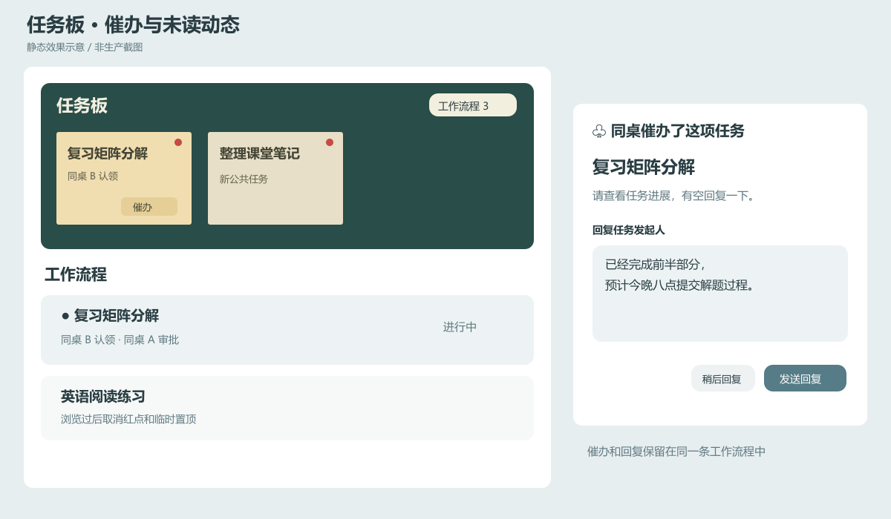

# 催办、回复与任务动态提醒

实施日期：2026-09-09。

## 操作与通知

原任务所属成员或公共任务发布者可以在任务便签、流程详情中点按“催办”。催办记录写入对应工作流程；认领者网页在下一次现有本地记录检查时抖动并弹出回复框，通常不超过约 5 秒，重新回到网页时也会检查。后台标签页不主动弹窗抢占交互。开启系统“减少动态效果”时保留弹窗并省略抖动。

认领者可以直接在弹窗回复，也可以点“稍后回复”后从流程中的催办记录继续回复。回复保留与原催办的关联，不改变提交或审批状态。每条催办只接收一条回复，同一请求重试不增加重复记录。未结束流程的发起人才能催办，其他成员不能代发；认领者只能回复自己的催办。

当前认领规则是一个任务只能有一条未结束的认领流程，因此每项任务的当前全部认领者就是该流程的认领成员。本次保持这一规则，没有把催办操作扩大为全室无关成员提醒。

新建公共任务和每条新增工作流程记录进入同一套持久通知记录，并复用现有 Web Push 订阅。公共任务通知其他成员；流程事件通知相关的原任务方、认领者，并排除事件操作人。系统自动生成的异常记录通知双方。手机、手表沿用新消息的通知授权与系统设置，消息内容可点击进入任务板或对应流程。

网页前台使用现有新消息提示音，同一次刷新收到多条新动态时合并响铃一次。每条推送带唯一事件标识，避免刷新或已处理请求重试再次响铃。服务端先保存发送尝试再发送；推送服务响应丢失时不重复发送，网页内未读记录始终保留。这种策略避免重复打扰，但不能保证进程恰好中断期间每次系统通知都能送达。系统免打扰、手机和手表的通知转发设置仍由设备控制，网页不能保证每种手表必定响铃或震动。

## 未读计数与一次性提示

| 位置 | 显示内容 | 浏览后的变化 |
| --- | --- | --- |
| 顶部任务板入口 | 未读公共任务数加未读工作流程记录条数 | 对应内容被浏览后减少；进入面板本身不清空全部记录 |
| 公共任务便签 | 新公共任务显示红点 | 便签实际出现在可见区域约 1.2 秒后标为已读 |
| 任务板内工作流程按钮 | 未读工作流程记录条数 | 与流程记录浏览情况一致，按条数而非流程数量计数 |
| 工作流程列表 | 有新记录的流程置顶并显示红点 | 行实际可见约 1.2 秒后清除此行记录的未读，回到正常创建时间顺序 |
| 流程详情 | 新事件旁显示红点 | 直接进入详情时按事件实际可见情况清除，未滚动到的事件继续保留 |
| 已完成归档入口 | 归档任务存在新记录时显示数量 | 在归档列表或详情浏览后清除，不把历史完成任务混入未完成列表 |

浏览状态保存在服务器并按用户区分，同一用户的其他设备在下一次本地状态检查时同步。后台页面、弹窗遮盖下的任务板和滚动区域外的记录不提前标为已读；清除一层不会清除其他层的未读。旧版本已有任务与流程在升级时作为历史基线，不突然产生大批旧通知。

上图为静态效果示意，不是浏览器运行截图。

## 验证与交付边界

自动化测试验证角色权限、催办与回复幂等、原审批状态保持和逐用户未读持久化。HTTP 测试覆盖实际催办、回复、浏览确认路由与跨站来源拒绝；提供方模拟测试覆盖推送接收账户筛选、失效订阅清理和服务工作线程的事件去重与震动载荷。组件渲染测试核对未读置顶、归档角标以及催办入口权限。

最终生产构建、类型检查与全量 108 项测试通过，新增可见性测试验证部分露出、快速滚过、后台标签页和完整停留的不同结果。所有测试使用隔离数据和模拟推送，没有向真实成员发送试验消息。实际手机响铃、手表转发以及浏览器滚动观察仍需设备验收。GitHub 推送与生产上线是两件事；最近一次已确认的部署失败来自服务器仍使用仓库迁移前的镜像地址，需按部署说明更新服务器脚本。
