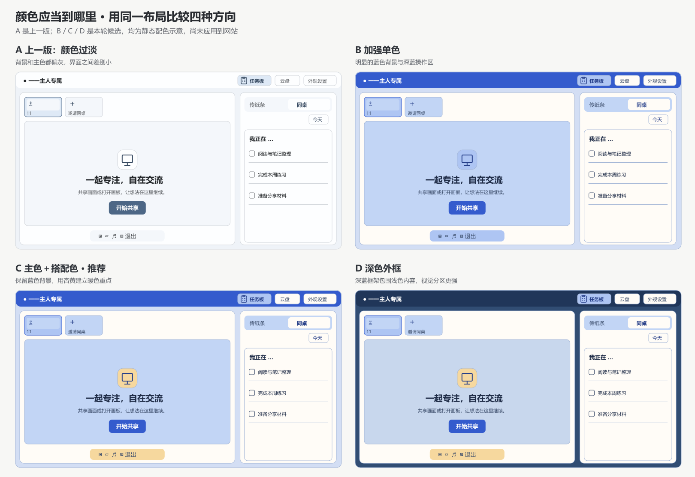
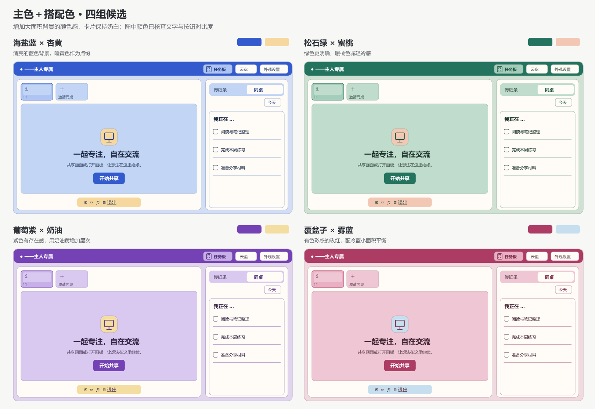

# 配色复调研：增加颜色感与配色层次

后续状态：用户未采纳以下候选，本轮调研已归档，后续转为【2】教室学院主题改造。以下建议和图片仅保留为历史资料，不作为待实施的已确认方案。

日期：2026-09-08。状态：已调研未实现，上一轮的近白背景方案已被用户否定，本报告提供新的视觉候选与自由选色建议，供下一轮实施使用。此次没有修改应用配色代码，图片属于以具体色值绘制的静态界面示意，布局简化且未经浏览器实机验收。

## 上一轮的问题

上一轮过度降低了背景和主色的彩度，六个预设又都选了偏灰的颜色，因此界面显得浅淡，各主题之间的区别也不明显。以蓝色共享区域为例，旧候选的 `#F4F7FB` 在 OKLCH 中明度约为 0.975、彩度约为 0.0062；此次蓝色候选使用 `#C2D5F5`，明度约为 0.869、彩度约为 0.0490，增加颜色感的同时也拉开了与卡片的明暗差异。

上一轮引用的办公产品设计规范强调克制，但用户希望自习室具有更明显的个性，两者不能直接等同。此次保留正文可读性的要求，重新考虑有色背景的面积和浓度，让浅色卡片、明确的主色操作区及少量搭配色共同构成界面。

## 本轮调研依据

| 来源 | 实际读取的内容 | 对本项目的启发 |
| --- | --- | --- |
| Material Color Utilities 0.3.0：Tonal Spot [1] | 主色 HCT 彩度为 36，第三色相对原色旋转 60 度；源码将其描述为低至中等色彩感 | 即便较温和的主题，也可以安排不同色相的搭配色 |
| Material Color Utilities 0.3.0：Vibrant [2] | 主色色板以很高的目标彩度请求尽可能鲜艳的颜色，第二与第三色使用按色相分段的旋转规则 | 自由颜色可以生成丰富主题，无需把所有颜色限制成灰调 |
| Material Color Utilities 0.3.0：Expressive [3] | 主色色相直接旋转 240 度，第二与第三色另有旋转规则，源码明确说明会有意偏离输入色 | 可以借鉴多色搭配，但本网站的自由选色应保留用户选择的主色相，避免选蓝色却得到另一种主色 |
| Radix Colors [4] | 实色阶不仅可以用于按钮，也列出网站区块、页头和图形等用途；不同色阶承担不同视觉角色 | 可以让顶部栏承担明确的主色块，内容表面采用较浅但仍有颜色的色阶 |
| Atlassian Design [5] | 强调程度从轻到重分别定义，浓色背景配置专用反色文字；装饰色与成功、警告等语义角色分开 | 浓色区域应单独配前景文字，搭配色不能造成错误或警告状态的误解 |

本轮固定读取 Material 的 0.3.0 版本，以便核对具体实现，没有将其当作当前最新版。HCT 与 OKLCH 的彩度数值不能直接相互套用，上表的源码参数只用于解释设计思路，下文候选为独立设计，没有运行 Material 算法生成这些色值。

## 同一页面的四种方向

| 方向 | 效果与取舍 |
| --- | --- |
| A：上一轮近白方案 | 作为比较基线，背景和强调色都偏灰，不再作为推荐方案 |
| B：加强单色 | 顶部栏与按钮使用明确主色，共享背景也有明显着色；改动较少，但仍可能显得单调 |
| C：主色加搭配色 | 在 B 的基础上加入少量暖色或冷色点缀，保持主题辨识度，同时增加配色层次；本轮推荐 |
| D：深色外框 | 用深色顶部和外框包围浅色内容，分区最明显；也更容易产生厚重感，作为备选 |

推荐 C 的原因是它直接回应了颜色过淡的问题，同时避免只把整个界面统一染得更浓。图中搭配色主要用于空状态图标底色及控制栏，任务正文仍位于浅色卡片中，这些位置和面积都是本项目的设计选择，并非外部规范的强制比例。

## 四组具体候选

| 候选 | 主色 | 共享区域 | 搭配色 | 倾向 |
| --- | --- | --- | --- | --- |
| 海盐蓝 × 杏黄 | `#345BCD` | `#C2D5F5` | `#F6D89E` | 颜色清亮，蓝黄区分明显，建议作为默认候选 |
| 松石绿 × 蜜桃 | `#23735F` | `#C0DCCD` | `#F2C8B5` | 绿色具有足够浓度，桃色减轻冷感 |
| 葡萄紫 × 奶油 | `#7442B4` | `#D9C8F0` | `#F4DDA0` | 紫色比之前鲜明，配色个性更强 |
| 覆盆子 × 雾蓝 | `#AD3C65` | `#EFC7D4` | `#C6DEED` | 保留明显玫红，用小面积蓝色平衡暖调 |

候选中的卡片使用奶白 `#FFFCF7`，顶部栏和主要按钮使用主色，共享画面使用较浅的同色区域。先比较整页效果，再看颜色名称；这些名称没有评价意义，候选也尚未经过用户偏好验证。

## 自由选色建议

自由选色应分别生成主色表面和搭配色表面，避免继续让一个 `--soft` 同时承担共享区域、普通输入框和所有工具栏。建议增加页头前景与背景、共享区域底色、搭配底色及其文字颜色等用途变量，使有色区域可以提高浓度而不会影响所有输入控件。

主色保留用户输入的色相，通过明度和彩度调整获得可读的按钮色。对于本轮这类彩色输入，共享背景可以探索 OKLCH 明度约 0.86 至 0.92、彩度约 0.035 至 0.065 的区间，这只是下一轮原型搜索范围，不能直接作为全部颜色的固定要求；近灰色输入仍应保持中性，不能自动增加鲜艳程度。

搭配色建议先围绕四组候选建立锚点，再在相邻锚点之间连续插值，而不要对所有输入统一旋转 180 度。后续实现需要检查拖动选色器时是否突然跳色，并验证黄色、青色及接近白色等输入；本轮尚未编写或验证完整的自由颜色算法，也不会用四组手工色板推导所有输入都能得到同样效果。

错误、完成及录音提示仍应使用各自的状态颜色，搭配色只承担装饰和分区用途。照片、实际共享画面和白板内容保持原色，主题只影响界面表面。

## 检查与实施状态

四组候选共检查了 32 对实际前景与背景组合。正文在共享区域上的最低对比度约为 8.85:1，次要文字在选中底色上的最低值约为 4.595:1，按钮文字最低约为 5.693:1；按钮与共享区域的对比度最低约为 3.819:1，检查中没有用显示时的四舍五入结果判断是否达标。

两张示意图已逐张查看，文字与主要区域均完整显示。这些检查证明所列色值配对满足设定阈值，未覆盖所有交互状态、自由颜色输入或移动端实际显示，也不构成整站无障碍验收。

本轮完成的是调研报告、候选色板和效果图，应用代码没有切换到任何新候选。上一轮代码提交尚未推送成功，本轮研究资料保存在项目中，原需求表已将此项重新标注为已调研未实现。

## 来源与复现

1. [Material Color Utilities 0.3.0 — SchemeTonalSpot](https://cdn.jsdelivr.net/npm/@material/material-color-utilities@0.3.0/scheme/scheme_tonal_spot.js)，2026-09-08 读取。
2. [Material Color Utilities 0.3.0 — SchemeVibrant](https://cdn.jsdelivr.net/npm/@material/material-color-utilities@0.3.0/scheme/scheme_vibrant.js)，2026-09-08 读取。
3. [Material Color Utilities 0.3.0 — SchemeExpressive](https://cdn.jsdelivr.net/npm/@material/material-color-utilities@0.3.0/scheme/scheme_expressive.js)，2026-09-08 读取。
4. [Radix Colors — Understanding the scale](https://www.radix-ui.com/colors/docs/palette-composition/understanding-the-scale)，2026-09-08 读取。
5. [Atlassian Design — Color](https://atlassian.design/foundations/color/)，2026-09-08 读取，含颜色用途、强调程度和对比度要求。

源码副本、制图脚本及 32 对颜色的检查结果位于本地 `codex-generated/theme-color-study`，正式报告和图片位于 `docs`。本轮尝试读取的 Adobe 色彩理论页面返回 404，没有作为报告证据。
