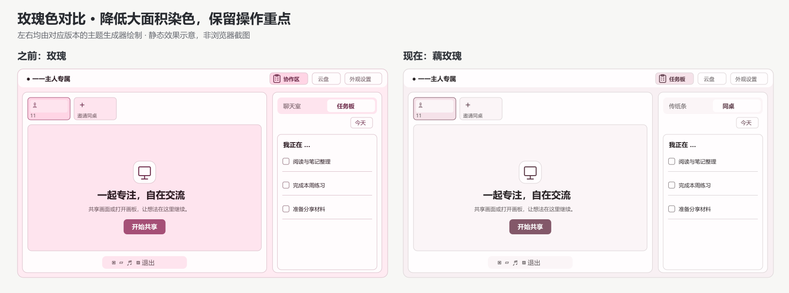
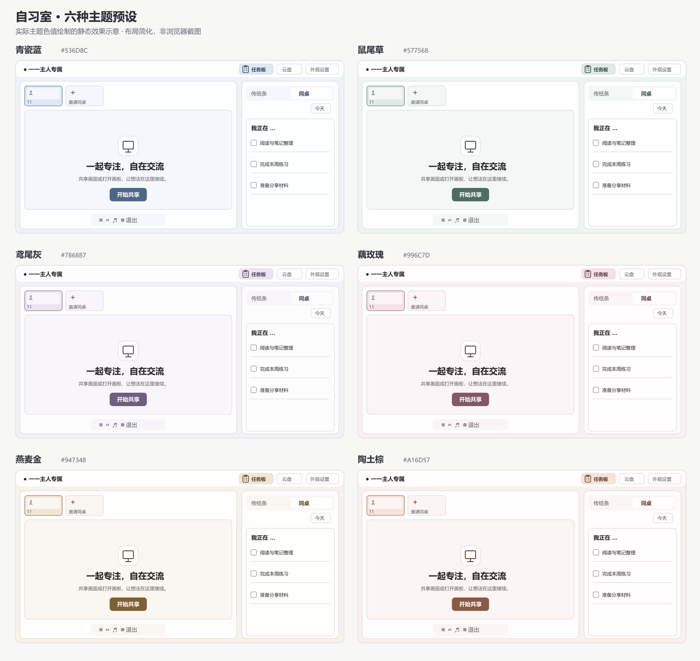

# 自习室入口与配色更新

日期：2026-09-08。按本轮截图要求完成代码实现，配色部分比较了 Radix Colors、Microsoft Fluent 2 和 IBM Carbon 的公开设计文档，并核对 W3C 的颜色与对比度说明。本报告接续 [9 月 7 日的主题调研](theme-color-research-2026-09-07.md)，下文取代其中的四个旧预设与背景生成参数。

## 实际效果示意

以下图片使用修改前后代码生成的真实色值绘制，布局进行了简化，属于静态效果示意，不能代替浏览器截图或实际设备验收。比较时建议先看共享画面的大片背景，再看任务文字与操作按钮的区分。

## 原先为何不协调

上一版已经把主要区域接入主题变量，因此本轮截图中的大面积偏粉主要来自生成规则。页面、共享区域和选中背景都由同一彩度按比例推导，选中底色的彩度系数达到 0.43；接近灰色的自由颜色还会被提高到至少 0.065 的彩度，使轻微偏暖的灰色产生超出选择预期的色调。

这些规则在蓝色下容易给人熟悉的蓝灰观感，但用于玫瑰或高饱和度颜色时，大片背景和文字会一起偏色。部分次要交互仍残留固定的粉色悬停与阴影，本轮也将媒体切换悬停、共享和摄像头按钮光晕及画面网格接入主题变量。

## 调研比较与选择

| 公开体系 | 文档中的做法 | 本项目采用方式 |
| --- | --- | --- |
| Radix Colors [1][2] | 分别为背景、组件状态、边框、实色和文字安排色阶；灰色可选择纯中性或与强调色接近的轻微着色灰 | 保留背景的冷暖倾向，让选中状态比普通表面更有颜色，不把高彩度主色直接用于大片背景 |
| Fluent 2 [3] | 中性色承担表面、文字和布局，品牌色用于按钮与选中状态；明确建议避免在大面积表面过度使用品牌色 | 正文接近中性，主题个性主要通过操作控件和选中区域体现 |
| IBM Carbon [4] | 默认主题以中性灰为主，通过不同明暗层次组织内容；颜色变量按用途定义，主题更换时用途保持一致 | 保持页面、卡片、内层表面之间的明暗顺序，用轻量边框建立层次 |
| W3C CSS Color 与 WCAG [5][6] | OKLCH 将明度、彩度、色相分开表达；普通文字最低对比度为 4.5:1 | 继续在 OKLCH 中生成颜色并输出 sRGB 十六进制值，实际配对另用 WCAG 相对亮度公式验证 |

选择这套组合是为了适应长时间阅读待办和聊天的使用场景。文档支持的是颜色用途与可读性原则，下面六个颜色及中文名称属于本项目的审美选择，没有把它们描述成经过用户研究证明的最佳色板，也没有引入上述体系的组件库。

## 六种预设

| 名称 | 输入主色 | 视觉方向 |
| --- | --- | --- |
| 青瓷蓝 | `#536D8C` | 偏灰的冷蓝，作为默认方案 |
| 鼠尾草 | `#577568` | 克制的灰绿，与浅绿灰表面搭配 |
| 鸢尾灰 | `#786887` | 降低鲜艳感的紫色 |
| 藕玫瑰 | `#996C7D` | 保留玫瑰倾向，背景接近暖白 |
| 燕麦金 | `#947348` | 暖金棕，与淡米灰表面搭配 |
| 陶土棕 | `#A16D57` | 偏红的暖棕，提供另一种暖色选择 |

旧的 `blue`、`green`、`purple`、`pink` 存储标识继续有效，对应更新后的前四个预设；新增 `amber` 和 `clay`。已经保存的自由颜色保持原始输入值，重新使用新版规则生成界面颜色，预设按钮显示背景、选中底色及实际按钮色的三色样本。

## 自由颜色的适配规则

生成器不会再主动提高接近灰色输入的彩度。强调色的彩度上限为 0.16，页面与普通内层表面的彩度分别不超过 0.009 和 0.007，近白卡片不超过 0.0015；这些值是本项目的设计参数，不属于 WCAG 标准。彩色输入的背景仍有轻微的同色倾向，纯黑、纯白和灰色输入生成中性方案。

页面、卡片和普通内层表面的 OKLCH 明度分别固定为 0.962、0.996、0.975，选中底色使用 0.930，并单独限制彩度。这样更换自由颜色时，主要表面之间的层级保持一致，同时避免高饱和度输入给整个共享画面染上浓色。

按钮允许调整输入颜色的明度，过亮的黄色会成为可读的深金色操作控件，颜色面板仍显示用户选中的原色。正文、次要文字及按钮文字会检查与实际生成表面的对比度，悬停态也单独验证；所有输出都转换到 sRGB，超出色域时降低彩度，不直接截断单个 RGB 通道。

文件夹的黄色与黑板便签的材质颜色保留其对象含义，成功和错误状态也继续使用语义颜色。自由选色面板与十六进制输入均保留，设置仍保存在当前浏览器。

## 名称和新任务角标

右侧“聊天室”改为“传纸条”，右侧原“任务板”改为“同桌”；顶部“协作区”改为“任务板”，图标换为带勾选清单的任务夹板。入口的实际功能保持原有分工，顶部打开全室协作，右侧继续展示聊天或成员待办。

角标只计算当前公共区中尚未看过的任务编号。第一次成功读取会把已有任务作为基线，不给历史任务补发角标；以后出现新编号才提示，成功打开并显示任务板后标记已看，在已打开且可见的面板中加载的新任务也会标记已看。请求失败或后台隐藏期间的读取不会清除已有提示，任务仅修改标题、减少数量或重新出现已看过的编号时不会产生新提示。

已读编号按登录成员保存在当前浏览器，刷新页面后继续生效，同一浏览器的多个页签会在下一次同步时合并已读状态。该状态没有跨设备同步，清除浏览器数据后会重新建立基线；浏览器阻止存储时，本次页面会话仍可使用提示。

服务端原有的轻量版本接口增加当前公共任务编号列表，继续复用原来约 5 秒一次的检查。该接口读取自习室本地任务数据，不为角标调用滴答收集箱，也没有新增滴答外部勾选轮询。

## 验证范围

生产构建和 TypeScript 检查通过，完整自动测试 97 项通过、无跳过；修改文件 ESLint 无错误，主页面保留 3 条已有的原生图片优化建议。主题测试覆盖 216 个 RGB 网格样本和 6 个预设共 222 种输入，正文在主要生成表面上达到 7:1，次要文字达到 4.5:1，必要控件边界达到 3:1，按钮文字与悬停态达到 4.5:1；这是指定颜色变量配对的验证范围，不能推导为整站已完成 WCAG 验收。

新增测试还覆盖高饱和度颜色的背景彩度限制、近灰色输入、旧预设兼容与服务器默认色值一致性。角标检查包括历史任务基线、同数量替换、已读持久化和不同成员隔离；服务端测试确认编辑不改变通知编号，暂存或已完成任务不会进入列表，读取角标数据不查询外部收集箱。

两张静态效果图已逐张查看，文字与布局均可见。本轮未完成浏览器交互和移动端实机视觉验收，原生选色面板的外观也取决于设备及浏览器。

## 本轮读取的来源

1. [Radix Colors — Understanding the scale](https://www.radix-ui.com/colors/docs/palette-composition/understanding-the-scale)。色阶用途与亮色的前景选择，2026-09-08 读取。
2. [Radix Colors — Composing a palette](https://www.radix-ui.com/colors/docs/palette-composition/composing-a-palette)。中性灰和同色倾向灰的选择，以及语义颜色配对，2026-09-08 读取。
3. [Microsoft Fluent 2 — Color](https://fluent2.microsoft.design/color)。中性、共享与品牌色的用途，以及避免大面积滥用品牌色的建议，2026-09-08 读取。
4. [IBM Carbon — Color overview](https://carbondesignsystem.com/elements/color/overview/)。中性灰层次、浅色主题的分层与按用途定义的颜色变量，2026-09-08 读取。
5. [W3C — CSS Color Module Level 4](https://www.w3.org/TR/css-color-4/#ok-lab)。OKLab、OKLCH 与色域概念，2026-09-08 读取。实现保留项目原有的彩度二分缩减方式，没有宣称实现文档中全部色域映射算法。
6. [W3C — Understanding SC 1.4.3: Contrast (Minimum)](https://www.w3.org/WAI/WCAG22/Understanding/contrast-minimum.html)。文字对比度要求及阈值不能向上取整的说明，2026-09-08 读取。Radix 文档中的 APCA 指标未与本项目采用的 WCAG 计算混用。

Material 的页面读取未成功，Adobe Spectrum 页面仅返回需要 JavaScript 的提示，两者均未作为本报告的实现证据。临时来源副本和制图脚本保存在 `codex-generated/theme-refresh`，正式报告与效果图随项目同步。
