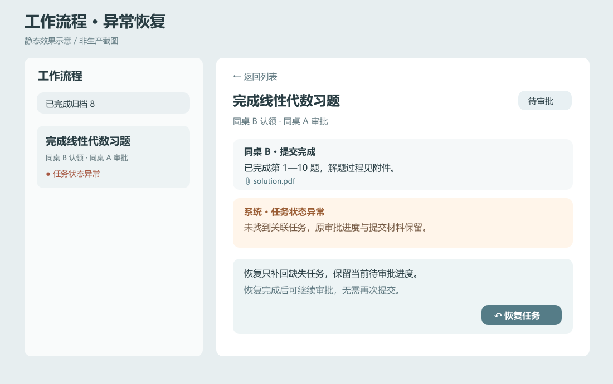
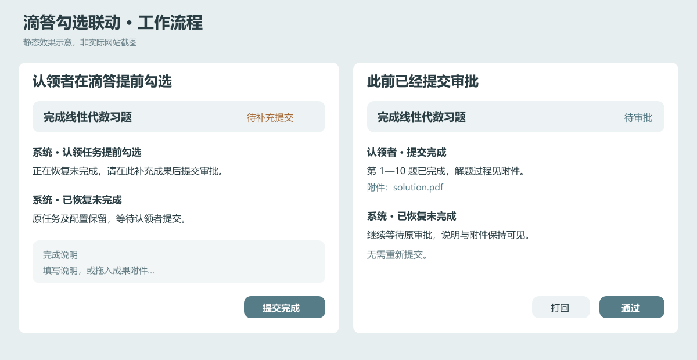

# 滴答状态核对与任务恢复

调研及实施日期：2026-09-09。异常恢复与外部勾选联动均已实现；下文记录处理规则和验证边界，模拟接口验证不能替代真实双账户验收。

## 已实现：异常记录与原流程恢复

沿用协作区打开时及可见期间约 15 秒的读取，没有新增滴答定时器。普通个人任务、自己的公共任务入箱记录及已归档流程不做额外检查。已经建立且尚未结束的流程先复用双方收集箱数据，缺少关联任务时才查详情；查询失败时显示读取错误，不生成“任务缺失”的判断。

成功查询后仍未找到任务，在原流程追加一次“任务状态异常”。参与者可以点击恢复；服务器先读取双方，保留存在的任务，只按最近保存的流程配置补回缺失任务。新 ID、创建回执和进度保存在原流程中，部分成功后重试继续未完成部分。响应丢失时先核对已创建 ID 或唯一候选，不能确定时停止重复创建。

恢复不会改变流程状态。待审批仍为待审批，原提交附件、完成说明与此前的审批评语全部保留。只有补回的一方更新审批核对用的版本，另一方若在滴答中修改了任务，仍会受到既有“提交后任务变化”检查约束。已进入完成同步的流程恢复任务后也不会自动继续勾选，需要按现有重试入口继续。

上图是静态效果示意，展示任务状态异常与待审批并存，以及恢复入口的位置；不代表生产网站截图。

## 官方接口证据

来源为当日下载的[滴答 Open API 文档](https://developer.dida365.com/docs/openapi.md)。本次只访问公开文档，没有读取或修改真实用户任务。

| 能力 | 文档支持与限制 | 实施取舍 |
| --- | --- | --- |
| 按清单与任务 ID 查询详情 | `GET /project/{projectId}/task/{taskId}`；Task 模型说明 `status=0` 未完成、`2` 完成、`-1` 放弃 | 只有成功返回明确完成状态才进入完成分支；404 与网络失败分别处理 |
| 查询已完成任务 | `POST /task/completed`，支持清单和完成时间范围，最多 200 项 | 可以提供完成证据；列表未命中不能证明任务不存在 |
| 跨清单查状态 | `POST /task/filter`，支持状态筛选，最多 200 项；`GET /project` 列举账户可访问的清单 | 已实现共享筛选搜索；未命中时继续列举清单，分批按精确任务 ID 查询，找到后保存位置并用于后续编辑、完成 |
| 按 ID 查询未完成任务 | `POST /task/undone` 支持 taskIds，但必须指定最长 14 天的日期区间 | 无日期任务和区间外任务无法靠此请求完整覆盖，不作为通用存在性证明 |
| 移动任务 | `POST /task/move` 有明确来源、目标清单 | 证明接口具有移动操作，但不会告知网站之前是否发生移动；本次不主动移动任务 |
| 取消完成 | 单任务更新参数表未列主任务 status；批量更新接受 Task 模型，而该模型包含 status | 已实现批量更新 `status=0`，保留提供方其他字段并读取核对；接口拒绝或结果不符时保留恢复进度和错误，不视为成功 |

接口可以通过“列举可访问清单，再按同一任务 ID 查询”的方式定位移动任务，不能把单次筛选未命中视为无法区分移动和删除。实现先使用最多 200 项的共享筛选减少请求；仍未找到时再查询其他可访问清单，每批最多并发 3 次详情请求。任一查询失败都保留读取错误，只有所有查询成功且仍无匹配时才提供缺失恢复。关联只按精确 ID 修正，不使用同标题判断移动，也不增加用户确认步骤。

已经记录异常的流程停止重复跨清单搜索，点击恢复时再重新读取双方，避免每 15 秒重复遍历清单。正常双方任务均在收集箱时没有额外详情查询。这不能证明某个已失去访问权限的清单中完全不存在任务，但不会把明确返回的授权失败当成删除。

## 已实现：外部勾选联动

沿用协作区打开及约 15 秒刷新，不增加独立定时器。提交、通过或打回审批时也会核对关联状态，并先验证操作者身份。普通个人任务、自取公共任务及归档流程不进入此同步流程。

原任务方的滴答任务明确为已完成时，流程记录“原任务方已在滴答完成”，同步完成认领者的对应任务并归档。公共任务使用发布者的关联任务作为原任务。双方完成进度在发送请求前后持久保存，部分成功及响应丢失沿用完成同步重试入口，避免重复勾选已经确认的一方。

只有认领者的滴答任务完成时，保存恢复记录，再通过批量更新将原任务恢复未完成，保留日期、优先级、检查项等配置及提供方其他字段。恢复后读取同一任务 ID 与清单核对状态和配置，不创建副本。尚未提交的流程显示“待补充提交”，要求完成说明或附件后才可提交；已经待审批的流程继续待审批，原提交材料保留。

恢复失败会显示原因并保留进度，自动重试间隔至少一分钟，参与者可以点击“重试同步”。响应丢失后若读到原任务已经恢复且配置一致，直接确认，不再次写入。恢复只更新认领任务的审批版本，并核对其配置是否仍与提交时一致；原任务方在滴答修改配置，或者认领者同时修改了任务要求，仍会阻止旧材料直接通过审批。

任务详情返回 404 时，先尝试跨清单精确 ID 查询；任务筛选或完成历史若明确返回同一 ID 的已完成任务，可作为完成证据。完成历史按账户共享一次读取，最多返回 200 项；未命中不当作完成，仍走任务状态异常与用户恢复入口。接口失败仅提示错误。

这些系统事件沿用已有工作流程记录、未读计数与手机推送通道，不增设通知通道，也不会为旧事件重复生成记录。当前刷新会同时更新返回的收集箱列表，避免刚恢复的任务需要等下一轮才显示。

图中左侧展示首次补充成果，右侧展示已有提交材料时保留待审批状态；均为静态示意。

### 重复任务及实际接口的边界

同一任务仍有明确完成状态、关联日期未改变时，按上述规则处理。若滴答已将重复任务推进到下一次日期，当前实现显示“重复任务日期已变化”，暂停自动恢复或完成；它不会把下一次任务改回上一期，也不会自动补建另一个重复系列。完成请求响应丢失时，同样保留此前的重复任务防重复勾选保护。这一保护不等同于已实现重复任务跨期历史实例重建。

真实滴答账户对批量取消完成的接受行为、重复任务的实例变化和实际移动设备通知仍需实机验收。本轮验证使用隔离数据和模拟接口，不修改真实学习任务，不能把自动化验证描述成真实双账户测试。

## 验证记录

新增自动化验证覆盖待审批恢复并继续审批、提交附件保留、公共任务双侧恢复、响应丢失与重启重试、旧请求不能恢复后续异常，以及并发恢复不重复创建。提供方测试覆盖精确移动关联、跨清单编辑和完成、共享有界查询，以及授权失败、限流和畸形响应。

异常恢复首个独立单元通过当时的全量 106 项测试；后续补充跨清单枚举与通知功能后，最终生产构建、类型检查及全量 108 项测试通过，修改文件 ESLint 无错误。真实浏览器交互、真实滴答双账户和上线状态须单独验收；服务器部署脚本仍需完成仓库迁移后的镜像地址更新，代码推送不等同于已经上线。

外部勾选联动追加验证：生产构建、类型检查、修改文件 ESLint 及全量 115 项测试通过，其中包含真实网站路由配合隔离模拟滴答接口的 HTTP 测试。新增验证覆盖原任务方直接完成、认领者恢复、待审批材料保留、并发配置变化、响应丢失后重启与节流重试，以及重复任务推进日期后的保护。没有进行真实账户写入或实际推送送达测试。
